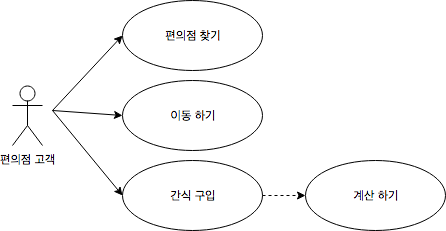
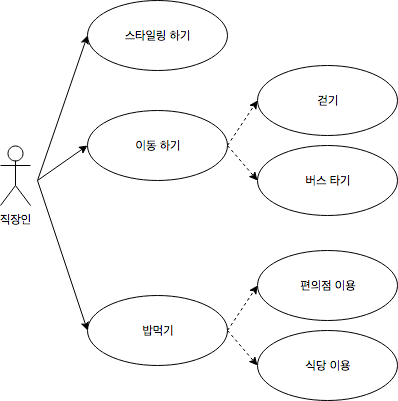
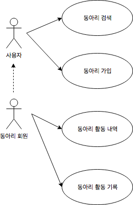
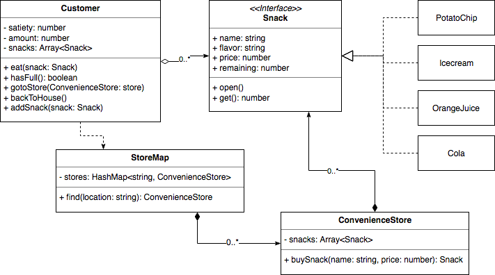
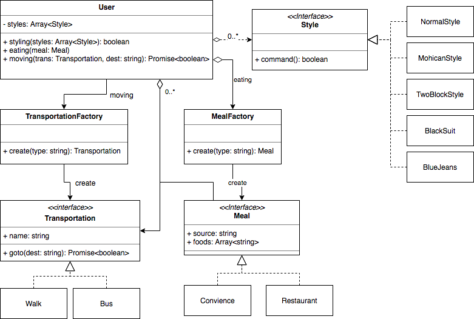
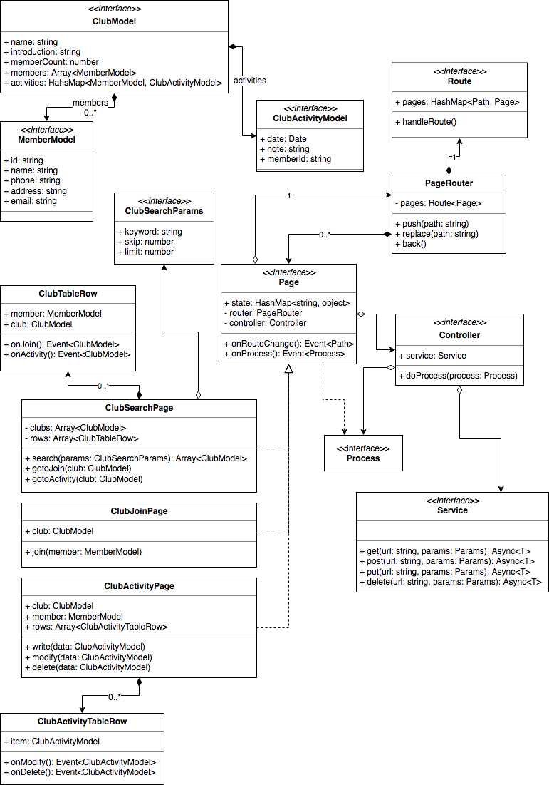

# 시스템 분석 및 설계 가이드

시스템 분석 및 설계 (Analysis & Design) 진행 시 필요한 자료를 정리 해 놓았다.

본 문서의 가이드 내용은 작성자가 필요 시 수행하는 분석 설계 방법을 다루고 있으며 알려진 방법을 기반으로 어느정도 개인화 (Customize) 기법이 포함되어 있다.

시스템 분석 설계 내용은 UML 일부를 활용하고 있으며 다음과 같은 내용을 읽어보길 권장한다.

- [프로그램 시나리오 - Use Case 작성](https://m.blog.naver.com/PostView.nhn?blogId=umeo111&logNo=221159850909&proxyReferer=https%3A%2F%2Fwww.google.com%2F)
- [UML: Class Diagram (nextree)](http://www.nextree.co.kr/p6753/)
- [UML: Sequence Diagram](https://thinking-jmini.tistory.com/29)

## 필요한 이유

시스템 분석 설계는 아래와 같은 상황에 필요하다.

1. 복잡한 업무에 대한 프로세스 정리
   - 주어진 업무가 간단히 해결되지 않을 때 유용하다. 전반적인 큰 그림을 그리고 데이터 및 로직의 흐름을 살펴 볼 수 있기 때문.
2. 시행착오 최소화
   - 다이어그램을 그리며 설계를 진행함으로써 의사 코드 (pseudo code)를 대체하여 수행 결과를 예측 해 볼 수 있다.
   - 때문에 반복적인 코딩 결과에 의존하여 뺏기는 시간을 절약 할 수 있다.
3. 업무공유
   - 구성된 로직과 구성도를 분석 설계 결과 문서를 통해 공유 할 수 있다.
   - UML 을 알고 있다면 훨씬 수월하게 업무가 공유 가능하다.

## 분석 및 설계 과정

진행 순서는 아래와 같다.

(단, 상황에 따라 순서는 변동 가능하며 다른 과정이 불필요한 경우도 있다.)

1. Use Case (사용 사례) 작성
2. Use Case Diagram 작성
3. Class Diagram 작성
4. Sequence Diagram 작성

## Use Case

유스케이스란 SW 가 업무를 진행하는 시작부터 끝까지를 차례대로 순번을 메기며 나열한 문장을 뜻한다.

아래는 편의점에 간식을 사러가는 상황에 대한 유스케이스 이다.

1. 집을 나선다
2. 편의점으로 지도를 보며 찾아간다.
3. 가게에 들어가 원하는 간식을 찾는다.
4. 찾은 간식을 계산대로 가져 간다.
5. 돈을 주고 계산한다.
6. 인사를 하고 편의점을 나선다.
7. 집으로 간다.
8. 사 온 간식을 맛있게 먹는다.

위와 같이 특정한 사건이나 행동에 대하여 하나씩 순서로 나열하면 된다.

단, 가능한 한 그 과정과 순서를 상세히 기록 해야 한다.

### 실습1

아래 내용을 유스케이스로 작성 해 보자.

- 기타 동아리에 가입하고 하룻동안 활동하는 내용

```
1. 온라인 카페에서 기타 동아리를 검색 한다.
2. 원하는 기타 동아리를 찾아서 가입한다.
3. 활동 일시를 확인한다.
4. 확인된 일시에 맞추어 가기 위해 교통편과 장소를 확인한다.
5. 활동 당일, 가는 시간에 맞추어 일찍 집을 나선다.
6. 버스를 타고 시간에 맞추어 동아리 모임 장소에 도착한다.
7. 동아리장을 찾아가 본인 인증을 한다.
8. 동아리 활동 소개 안내를 해 주는 멤버를 따라가서 활동 물품과 지켜야 할 사항을 전달 받는다.
9. 동아리에서 관리하는 어쿠스틱 기타와 관련 자료를 습득 한다.
10. 지정된 자리에 앉아 기존 멤버의 지시대로 연습 한다.
11. 지시 한 연습이 제대로 끝날 때 까지 연습을 반복 한다.
12. 연습이 끝났다면 확인을 받고, 끝나지 못했다면 11번으로 되돌아간다.
13. 동아리 활동 시간을 체크하고, 아직 끝나지 않았다면 다른 연습을 진행하고 10번으로 돌아간다.
14. 동아리 활동을 종료하고 귀갓길 교통편을 확인한다.
15. 귀가 한다.
```

### 실습2

아래 내용을 유스케이스로 작성 해 보자.

- 출근 부터 퇴근까지의 모든 과정 (회사 생활 포함도 OK)

```
1. 알람에 맞추어 일어난다.
2. 시간을 확인하고 여유가 있다면 조금 더 잔다.
3. 시간적 여유가 없다면 일어나서 스트레칭을 한다.
4. 컴퓨터를 키고 뉴스를 보면면서 아침밥을 먹는다.
5. 화장실로 들어가 몸을 씻는다.
6. 날씨 앱을 확인하여 그 날 온도를 확인하여 입을 옷을 결정 한다.
7. 입을 옷이 결정 되기 힘들다면, 패션 앱을 검색하여 그날 입을 옷을 결정 한다.
8. 입을 옷이 결졍 되었다면 미리 옷을 빼 놓는다.
9. 스킨로션을 바르고 머리 세팅을 한다.
10. 옷을 갈아입는다.
11. 만약 입은 옷이 맘에 안든다면 10 번으로 돌아 간다.
12. 향수를 뿌리고 외출 준비를 한다.
13. 시간에 맞추어 버스 정류장에 도착 한다.
14. 회사에 가는 버스가 몇시에 올지 확인 한다.
15. 회사가는 버스에 탄 인원을 보며 만원버스 이거나 지옥버스라면 걸러서 14번으로 돌아간다.
16. 버스를 타고 빈자리가 있다면 앉는다.
17. 듣는다고 싶은 음악이 있다면 이어폰을 꼽고 노래를 듣는다.
18. 버스가 도착할 때 까지 대기 한다.
19. 버스가 목적지에 도착 했다면, 버스에서 내린다.
20. 회사 가는 방향으로 걷는다.
21. 만약 지각하기 직전이라면 뛴다.
22. 가다가 신호등에 걸리면 선다.
23. 그렇지 않다면 그냥 갈 길 간다.
24. 가다가 아침밥이 생각 난다면 편의점에 들러 샌드위치를 산다.
25. 회사에 도착하여 문을 열고 지하로 가서 샌드위치를 먹는다.
26. 먹고 사무실로 가는 도중 아는 직원을 보면 인사를 한다.
27. 자리에 앉아 업무 준비를 한다.
28. 주어지는 업무를 처리 한다.
29. 점심이 되면 밥을 먹는다.
30. 점심밥 먹고 쉬고 싶다면 잠시 누워서 잠을 청한다.
31. 점심 시간이 끝났다면 다시 업무를 시작한다.
32. 주어지는 업무를 처리 한다.
33. 퇴근 시간이 되었다면 회사를 나선다.
34. 나설 때 아는 사람들에겐 인사를 하고 나간다.
35. 퇴근 길에 출출하면 편의점 들러서 빵하나 사 먹는다.
36. 버스 정류장까지 간다.
37. 가다가 바로 앞에 울집 가는 버스 있으면 뛴다.
38. 버스에 올라타서 자리가 있다면 앉는다. 아님 서서 간다.
39. 울 동네에 버스가 도착하면 내린다.
40. 신호 대기 하다가 청신호면 건넌다.
41. 집까지 걸어간다.
42. 문을 연다.
43. lol~ 끗
```

### 실습3

아래 샘플 기획서를 바탕으로 유스케이스를 작성 해 보자.

- 기타 동아리를 검색하고 활동 내역을 기록할 수 있는 시스템

[샘플 기획서 바로 가기](https://docs.google.com/presentation/d/1mD_GNDjhfhpossZY3LxQIFjLrWBvOX3ewwmbhKXIS7Q/edit?usp=sharing)

```
1. 활동 할 동아리를 검색하기 위해 동아리 검색 화면에 접근 한다.
2. 원하는 동아리명을 검색 후 목록을 확인한다.
3. 원하는 동아리명이 검색 되었다면 '가입하기'를 누른다.
4. 동아리 가입 화면에서 소개 화면을 본다.
5. 마음에 든다면 아래 입력란에 입력 후 '가입'을 누른다.
    1. 마음에 들지 않는다면 뒤로가기 하고 2번으로 되돌아 간다.
6. 가입 후 활동 하였다면 활동 내역을 기록하기 위해 먼저 동아리 검색 화면으로 들어간다.
7. 가입 된 동아리를 검색 하여 '활동내역' 클릭 후 들어간다.
    1. 만약 가입된 동아리가 없다면 1번으로 되돌아 간다.
8. 활동내역 기록 화면에 들어가 기존 활동 내역을 확인 한다.
    1. 만약 이미 최근 활동 내역이 작성 되어있다면 넘어간다.
    2. 작성되어 있지 않다면 활동일시와 내용을 작성하고 '작성완료'를 누른다.
9. 기존 활동내역을 바꾸기위해 수정을 누른다.
    1. 활동내역 기록 화면에 기존 활동내역이 출력되고, 변경할 수 있게 된다.
    2. '작성완료'를 누르면 변경이 완료 된다.
10. 기존 활동내역이 마음에 안들어 삭제를 누른다.
    1. 확인창이 뜬 뒤 '예'를 누르면 삭제 된다.
11. 종료한다.
```

### 실습4

위 샘플 기획서를 이용하여 이번엔 '시스템 관점' 에서 작성 해 보자.

```
동아리검색
1. 최초 사용자 접근 시 모든 동아리 데이터를 찾아 준다.
2. 이 때 모두 뿌려주면 부하가 걸리니 페이징 하여 최대 10개를 보여준다.
3. 키워드에 맞는 동아리 데이터를 최대 10개를 페이징하여 보여준다.
4. 만약 검색 키워드에 맞는 동아리 데이터가 없을 경우 '자료가 없습니다'를 출력 한다.
5. 가입하기를 누르면 동아리 가입 화면으로 redirect 한다.

동아리 가입
1. 파라메터로 전달 된 동아리 ID를 이용하여 동아리 상세 내용을 출력 한다.
2. 이름, 연락처, 주소 및 이메일 등 입력란 입력 시 유효성 체크를 한다.
3. 만약 유효하지 않다면 사용자에게 알려준다.
4. 가입 버튼 누를 시 입력된 값이 정상이라면 사용자 ID와 함께 API 호출하여 서버에 전달 한다.
5. 만약 가입 실패 시 실패 사유를 alert 으로 알려준다.
6. 가입 후 동아리 검색 화면으로 redirect 한다.

가입된 동아리 검색
1. 최초 접근 시 모든 동아리 데이터를 찾아준다.
2. 역시 최대 10개 페이징하며, 검색 키워드에 맞는 자료가 없을 경우 '자료 없음'을 출력 한다.
3. 출력된 자료 중 해당 사용자가 가입된 동아리가 있을 시 '활동내역' 버튼을 활성화 한다.
4. '활동내역'을 누르면 활동내역 기록 으로 redirect 한다.

활동 내역 기록
1. 파라미터로 전달 된 동아리와 사용자 ID를 이용하여 활동 내역 목록을 출력 한다.
2. 활동일시는 Date picker 로 제공하되, 포멧이 맞지 않거나 비어 있는 상태에서 작성 완료 누르면 '잘못된 입력입니다' 를 출력 한다.
3. 내용이 비어 있는 상황에서 '작성완료'를 누르면 이 역시 '내용을 입력하세요'를 출력 한다.
4. 입력값이 모두 유효할 때 '작성완료'를 누르면, confirm 으로 확인 후 yes 일 경우 입력 값과 사용자 ID 및 동아리 ID를 함께 API 로 전달 한다.
5. 전달이 성공이라면 '작성 완료'를, 실패하면 실패 사유를 출력 한다.
```

## Use Case Diagram

위에 작성된 유스케이스를 기반으로 사용자나 시스템 관점에서 생각해 볼 수 있는, 혹은 접근 가능한 기능과 의의를 그림의 형태로 정의해 둔 것이다.

이 것을 작성 함으로써 시스템의 전반적인 큰 목적을 명확하게 알 수 있다.

아래 사이트를 확인하여 다이어그램 작성 방법에 대하여 상세히 알아보자.

- [Use Case Diagram - 요구사항부터 구현까지](http://www.jidum.com/jidums/view.do?jidumId=976)

### 예제1

편의점에 간식 사러 가는 상황에 대한 다이어그램은 다음과 같다.



위 그림처럼 화살표는 필요로 하는 방향으로 설정 해야 한다.

즉, 고객 입장에선 편의점 찾기가 필요 한 것이고, 간식 구입 입장에선 계산하기가 필요한 것이다.

실선은 직접적으로 수행, 혹은 필요한 것이고, 점선은 확장(extends) 되거나 포함(include) 되는 업무를 말한다.

유스케이스 다이어그램 작성 시, 위 예제처럼 업무상의 큰 흐름에서 작성 해야 한다.

즉, 행위자(Actor) 입장에서는 굳이 몰라도 되는 것 까지 상세히 작성할 필요는 없다.

### 실습1

출퇴근 내용에 대한 유스케이스 다이어그램 작성



### 실습2

상기 제공된 샘플 기획서를 바탕으로 유스케이스 다이어그램 작성



## Class Diagram

클래스 다이어그램이란, 실제 프로그래밍 업무에서 쓰일 수 있는 여러 클래스와 인터페이스, 객체들의 기능(method)과 속성(attribute)을 정의하고 각각의 개체(individual)의 연관 관계 (association) 를 그림으로 표현한 것이다.

각 요소의 정의는 상기에 링크된 웹페이지들을 먼저 참고 하도록 한다.

### 예제1

편의점에 가서 물건을 사고 집에 돌아와서 먹는 과정에 대한 클래스 다이어그램 이다.



#### 설명

- Customer: 편의점을 이용하는 고객이다. 다음과 같은 기능을 가진다.
  - 먹기 (eat) : 먹을 때 Snack 객체가 필요하며, 먹을 시 내부적으로 Snack의 open 수행 및 get 을 수행하여 satiety 를 늘린다. 이게 100 수치가 되면 배부름 (full) 상태가 된다.
  - 배부름 여부 (hasFull): 먹다가 배부른지 여부를 확인할 수 있다. satiety 가 100이면 배부르다 판단 한다.
  - 가게로 이동 (gotoStore): 지정된 편의점으로 이동 한다. ConvenienceStore 객체가 필요하다.
  - 집으로 돌아오기 (backToHouse): 볼일이 끝났으면 집으로 이동한다.
  - 물품 추가 (addSnack): 구입된 물품(스낵)을 추가 한다. Snack 객체가 필요하다.
- StoreMap: 편의점을 검색해 준다. 검색 시 위치(location)이 필요하며, 검색이 맞다면 - ConvenienceStore 객체를 내어준다.
- ConvenienceStore: 편의점 객체. 내부에 스낵을 여러개 가지고 있으며, 스낵을 이름과 가격을 제시하여 구입할 수 있다. 구입 시 Snack 객체를 내어준다.
- Snack: 여러가지 스낵들에 대하여 추상화된 인터페이스. 편의점에서 판매되는 스낵들은 모두 이 - 인터페이스를 구현하여 사용된다.
  - 봉지 열기 (open): 스낵 봉지를 연다.
  - 과자 얻기 (get): 과자를 얻는다. 얻을 때 마다 remaining 이 줄어든다. 0이 되면 get - 수행 시 더 이상 얻을 수 없으므로 0을 준다.

### 실습1

출퇴근에 대한 내용을 기반으로 클래스 다이어그램 작성



### 실습2

상기 제공된 샘플 기획서를 바탕으로 클래스 다이어그램 작성


## Sequence Diagram

어떤 업무를 구성하는 객체나 클래스에서 자료(data) 나 행동(method)들이 서로 영향을 끼쳐 순차적으로 수행될 때 이를 모식화 한 것을 두고 시퀀스 다이어그램 (Sequence Diagram) 이라 한다.

일반적으로 가로축(Axis X)은 각 업무의 흐름에 영향을 끼치는 객체(Object) 들을 나열하며, 세로축 (Axis Y)은 업무의 시간적 흐름 (Timeline) 으로 이용된다.

아래 사이트를 참고 하여 간단한 실습을 해 보자.

- [Sequence Diagram Tutorial (영문)](https://creately.com/blog/diagrams/sequence-diagram-tutorial/)
