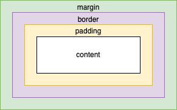

# Design System Component

본 문서는 디자인 시스템에 맞춰진 컴포넌트에 대하여 다룹니다.

## 작성 위치는 modules/system (가칭)

디자인 시스템 기반으로 만들어진 컴포넌트는 모두 이 곳에 둡니다.

이들은 특별한 목적이 없다면 모두 표현 컴포넌트(Presentational Component)로 두어야 합니다.

- modules
  - system
  - components
    - atoms
    - combines
    - complexes

외부에서 접근 시 `../modules/system` 과 같은 형식으로 사용할 수 있어야 합니다.

## 스스로에 대한 외부 여백에 관여하지 않는다

디자인 시스템 기반으로 제작된 컴포넌트는 자신이 어디서 쓰일지에 대해서 관심이 없도록 만듭니다. (SoC - 관심사 분리)

이에 따라 Box Model 기준, margin(바깥 여백)은 스스로 정하지 않습니다.

단 border 및 padding(안쪽 여백)은 스스로가 책임지고 렌더링 합니다.



margin 뿐만 아니라 그 외 추가적인 스타일이 필요하다면 오직 사용처에서 필요한 만큼 추가하여 변경 합니다.

이 때 `styled` 를 이용합니다.

아래는 예시 입니다.

```tsx
import React, { FC } from 'react';
import styled from 'styled-components';
import {
  // 스타일 추가가 필요할 땐 해당 컴포넌트 접미어(postfix)에 Base 를 붙여서 alias 하여 가져옵니다.
  Avatar as AvatarBase,
  CardImage as CardImageBase,
  // 추가 스타일링이 필요 없다면 그냥 가져와서 사용 합니다.
  CardWrapper,
} from '../../module/system';

// 스타일링이 완료된 컴포넌트는 본래 이름을 가집니다.
const CardImage = styled(CardImageBase)`
  margin-bottom: 0.5rem;
`;

const Avatar = styled(AvatarBase)`
  margin-right: 1rem;
`;

// 사용처인 컴포넌트에서는 가져와 사용하는 컴포넌트의 스타일링 변동 여부에 대해서 관심 없도록 합니다.
export Client: FC = () => {
  return (
    <CardWrapper>
      <Avatar />
      <CardImage />
    </CardWrapper>
  );
};
```
