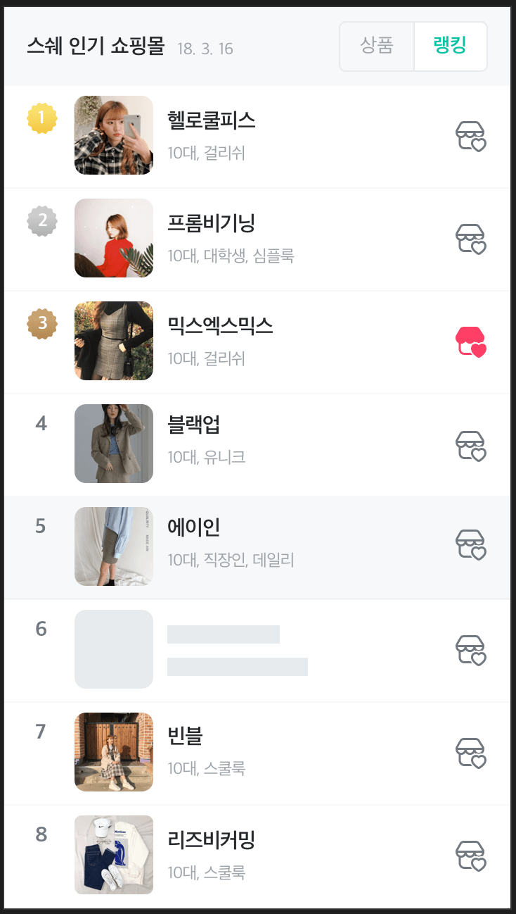
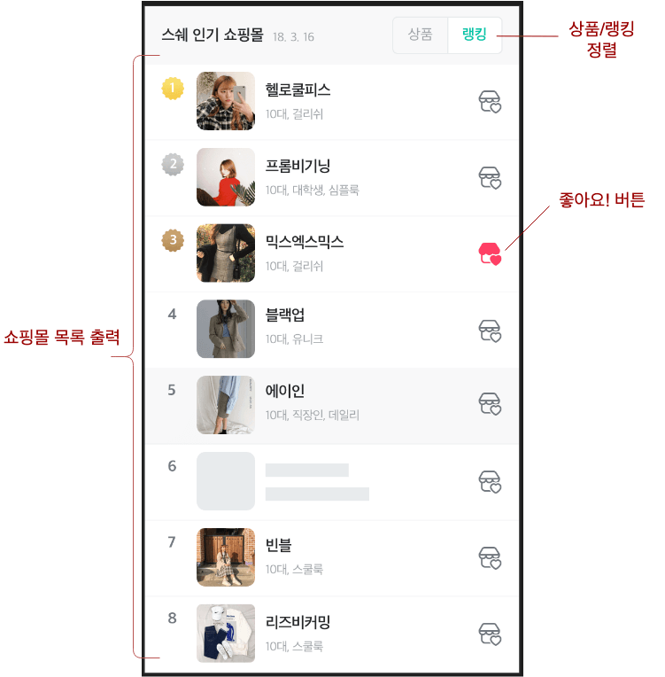
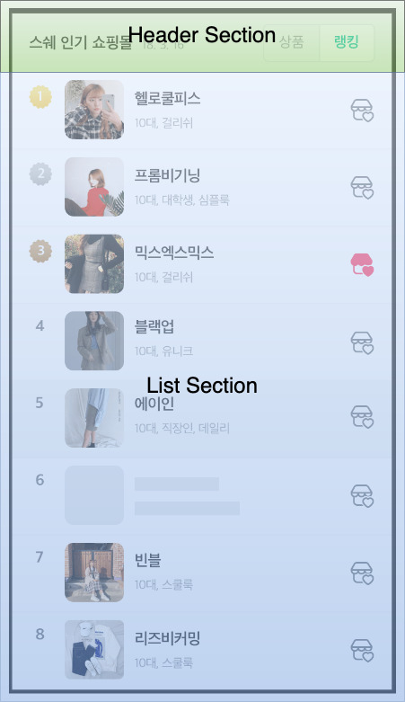
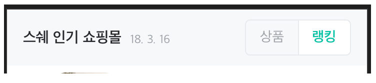
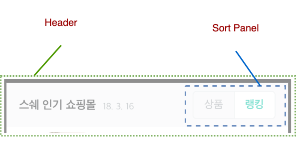
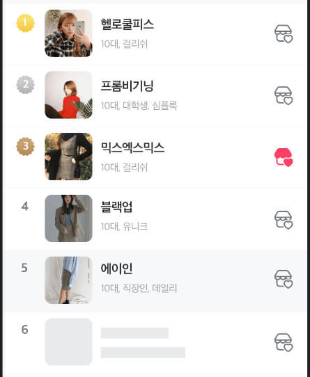
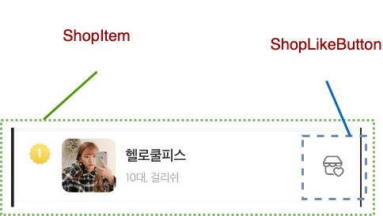
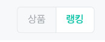
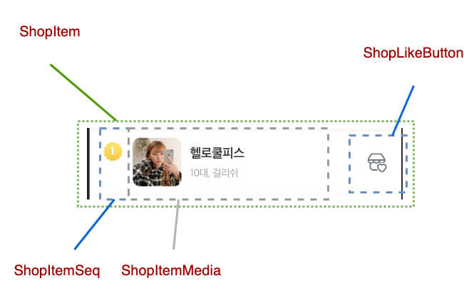

# User Interface Design - 1. 영역 분석

많은 경우의 UI는 그 `디자인 시안` 과 `기획서` 가 존재 합니다.

일반적으로 기획서를 바탕으로 디자인 시안이 나오게 되며

이제부터 알려드릴 내용은 이러한 디자인 시안이 존재한다는 가정하에 설명 합니다.

## 진행 순서

영역 분석은 다음과 같은 순서로 진행 합니다.

1. 도메인 분석
2. 영역 추출
3. 컴포넌트 추출

## 샘플 시안

이번 실습에 쓰일 샘플 시안입니다.



가급적이면 위 이미지를 따로 A4 용지에 출력하여 실습에 임해 주세요! 🙂

필기도구도 잊지 마시기 바랍니다~~!

## 도메인 분석

샘플 시안의 내용은 보시다시피 목록형 화면 입니다.

세부적으로 차이는 있을 수 있으나 목록형 화면은 일반적으로 `CRUD` 중 `R(Read)` 을 맡고 있습니다.

그럼 표현(Presentation) 기능에 집중한다는 것이죠.

그럼 어떠한 표현 기능 일까요?

화면 상단 제목(heading)에 표현되어 있습니다. 바로 `인기 쇼핑몰에 대한 목록(List)` 입니다.

목록 내 아이템(Item)은 어떤가요?

사진과 설명, 그리고 우측에 `좋아요 버튼`이 있습니다.

이건 뭘 하는 걸까요?

좋아요! ...니까 누르면 DB나 스토리지에 활성 내역이 보관되어 두고두고 내가 좋아한 쇼핑몰이 표시(marking) 되겠지요!

마지막으로 상단 헤더(header)를 보면 우측에 `상품/랭킹` 에 대한 정렬(sorting) 기능이 있군요!

더 있을까요?

음.. 🤔 제가 보기엔 없는거 같습니다. 🙂

그럼 찾은 내용을 정리 해 볼까요?

- 인기 쇼핑몰에 대한 자료를 목록으로 출력을 한다.
- 목록 내 우측 좋아요 버튼으로 별도 표시 가능하다.
- 상단에 상품/랭킹 별로 정렬 가능하다.

한편, 위 3가지 분석을 한마디로 정의하면 무엇일까요?

넵! `인기 쇼핑몰 목록 출력` 이 되겠습니다!

이게 이번 화면의 핵심 업무, 즉 도메인 입니다.



## 영역 추출

이제 화면내 영역을 나눠볼 차례 입니다.

방법은 쉽습니다.

척 봐도 업무적으로 확연히 구분되는 큰 영역으로 구분 지으면 됩니다.



이렇게 구분된 영역은 `React`의 Flux Architecture 기준, 추 후 `Container` 가 될 가능성이 매우 높습니다.

다시 한번 remind 해 보겠습니다.

Container 는 무슨 역할이죠?

네! `하나의 작은 업무를 완성하는 곳` 입니다!

## 세부적으로 나눠보기

큰 영역을 나눠 보았으니 각각의 영역을 세분화 시켜 보겠습니다.

뭐 부터 할까요?

가장 쉬워보이는 `Header Section` 부터 보겠습니다.

### Header Section



헤더 부분만 잘라 보았습니다.

어떤게 보이시나요?

저는 아래와 같이 2가지가 보이는군요!



각각의 구분 지은 이들이 바로 `Sub Domain` 입니다.

Header Section 의 서브 도메인을 정의 하면 `제목 출력` 과 `정렬 기능 제공` 입니다.

이들은 각각 명칭을 아래와 같이 정하겠습니다.

- 제목 출력 = Header
- 정렬 기능 제공 = SortPanel

구분 지은 것을 바탕으로 예상되는 `Component Markup`은 다음과 같습니다.

```xml
<Header>
  <SortPanel />
</Header>
```

이쯤되면

`"엇! 제목이랑 날짜랑 정렬하는 등등의 기능은 다 어디갔나효?"` ...라고 물으실텐데

그렇게 물으신다면, 대답해 드리는 것이 인지상정! ...이겠지만

아직은 그걸 할 때가 아닙니다.

지금은 큰 그림에서 분석 해 보는 것입니다.

그러니 침착하게 따라와 주세요 😅

### List Section



리스트는 아시다시피 같은 형식의 자료가 반복되는 구조 입니다.

그러므로 리스트 내 각 아이템(Item) 을 따로 떼어서 보겠습니다.


찬찬히 살펴 보세요.

어떤가요? 영역이 구분되어 보이실까요?

제가 보기엔.. 음.. 🤔

이것도 2가지로 구분되어 보입니다.



각 영역별 서브 도메인은 `아이템 자료 출력` 과 `좋아요 버튼` 입니다.

각 명칭은 다음과 같이 정하겠습니다.

- 아이템 자료 출력 = ShopItem
- 좋아요 버튼 = ShopLikeButton

아이템 요소에 대한 컴포넌트 마크업은 다음과 같습니다.

```xml
<ShopItem>
  <ShopLikeButton />
</ShopItem>
```

이들을 이용한 목록형 컴포넌트는 명칭을 `ShopList` 로 정했을 때 전체 컴포넌트 마크업은 아래와 같이 작성될 것으로 기대됩니다.

```xml
<ShopList>
  <ShopItem>
    <ShopLikeButton />
  </ShopItem>
  <!-- repeat -->
</ShopList>
```

### 세부 영역 추출 결과

자~ 지금까지 언급된 세부 영역들에 대해서 다시 정리 해 보겠습니다.

- Header Section
  - Header
  - SortPanel
- List Section
  - ShopList
  - ShopItem
  - ShopLikeButton

이들을 이용한 컴포넌트 마크업은 다음과 같습니다.

```xml
<Header>
  <SortPanel />
</Header>
<ShopList>
  <ShopItem>
    <ShopLikeButton />
  </ShopItem>
  <!-- repeat -->
</ShopList>
```

어때요? 잘 따라 오셨나요? 😆

이제 더욱 깊이 Dive 해 보겠습니다!

## 컴포넌트 추출

언급된 세부 영역을 바탕으로 실제 작성될 컴포넌트를 추출 해 보겠습니다.

우린 업무에 아토믹 디자인을 응용하고 있으니 필요 시 각 아토믹 레벨도 함께 언급 하겠습니다.

### 헤더 부분 추출

전에 알아본 내용을 다시 한번 보겠습니다.


우선 제목 부분부터 쪼개어 보겠습니다.

어떠세요?

어떻게 쪼개어야 할지 보이시나요?

참고로 저는 이렇게 보였습니다.


보시다시피 두개로 쪼개어 졌습니다.

`Heading` 은 메인 제목을, `SubHeading` 은 그 제목의 부가적인 내용을 표현합니다.

다음은 우측 `SortPanel` 입니다.



UI Pattern 을 보자면 전형적인 `Radio Button` 입니다.

2개로 나뉘는걸로 보이시나요?

그럼 2개로 나누면 됩니다!

다만, 각각의 라디오 버튼은 그 특성상 같은 그룹에 속해 있을 경우 같은 기능과 같은 디자인을 공유하게 됩니다.

따라서 아래와 같이 동일한 컴포넌트 2개를 붙여 놓았다고 볼 수 있습니다.


이들 라디오 버튼 명칭은 `SortRadioItem` 으로 명명 하겠습니다.

지금까지 추출된 내용을 컴포넌트 마크업으로 나타내면 다음과 같습니다.

```xml
<Header>
  <Heading>
    <SubHeading />
  </Heading>
  <SortPanel>
    <SortRadioItem />
    <SortRadioItem />
  </SortPanel>
</Header>
```

### 목록 부분 추출

상기 언급된 대로 List 부분은 Item 을 여러개 가지므로 Item 만 쪼개어 보겠습니다.


각자 고민 후 직접 쪼개 보시기 바랍니다. 🙂

저는 아래와 같이 쪼개어 졌습니다.



추가된 영역은 다음과 같습니다.

- ShopItemSeq : 아이템 번호를 출력합니다.
- ShopItemMedia : 내부 이미지와 텍스트를 표현 합니다.

엇! 근데 `ShopItemMedia` 가 좀 더 쪼개져야 할 것 같습니다.

그럼 좀 더 쪼개어 볼까요?


헉! 😱 갑자기 뭔가가 엄청나게 불어 났습니다!

하나씩 살펴 보겠습니다.

- ShopItem : 아이템 요소를 감싸는 Wrapper 역할
  - ShopItemSeq : 좌측 번호를 표현
  - ShopItemMedia : 가운데 컨텐츠를 표현
    - ShopItemImage : 프로필 이미지
    - ShopItemBody : 텍스트 컨텐츠를 표현
      - ShopItemHeading: 아이템 내 제목을 표현
  - ShopLikeButton : 좋아요 버튼

이렇게 늘어난 이유는 무엇일까요?

- 좌측 번호와 이미지, 텍스트와 버튼 각각이 다단(Multi-column) 으로 나열되어 있습니다.
- 이 중 이미지와 텍스트는 서로 연관된 것임을 한눈에 볼 수 있습니다.
  - 따라서 응집도(Cohension)를 높이는 차원에서 이들은 하나의 정보로써 묶이는 것입니다.
- 버튼은 별도의 UI 취급 입니다.

추출된 내용을 바탕으로 컴포넌트 마크업을 작성하면 다음과 같습니다.

```xml
<ShopList>
  <ShopItem>
    <ShopItemSeq />
    <ShopItemMedia>
      <ShopItemImage />
      <ShopItemBody>
        <ShopItemHeading />
      </ShopItemBody>
    </ShopItemMedia>
    <ShopLikeButton />
  </ShopItem>
  <!-- repeat -->
</ShopList>
```

## 추출된 내용 소집! 그리고...

앞서 언급한 요소들을 모두 집합시켜 컴포넌트 마크업으로 표현 해 보겠습니다.

```xml
<Header>
  <Heading>
    <SubHeading />
  </Heading>
  <SortPanel>
    <SortRadioItem />
    <SortRadioItem />
  </SortPanel>
</Header>
<ShopList>
  <ShopItem>
    <ShopItemSeq />
    <ShopItemMedia>
      <ShopItemImage />
      <ShopItemBody>
        <ShopItemHeading />
      </ShopItemBody>
    </ShopItemMedia>
    <ShopLikeButton />
  </ShopItem>
  <!-- repeat -->
</ShopList>
```

오! 엄청 많아졌군요! 😱

간단하다 여겼던 화면이었으나 각각의 영역과 역할을 추출하니 제법 많아졌습니다!

이쯤 되면, 이걸 다 작성해야 하냐고 물으실겁니다.

네! 물론 작성 하셔야 합니다! 😀

하지만 몇가지 요령을 아시면 작성해야 할 최종 컴포넌트 가짓수는 줄어들 것입니다.

## 분석 끝!

이제 여러분들이 이 페이지에서 만들어야 될 컴포넌트는 모두 추출이 되었습니다.

이제 작성하면 되냐구요?

아니요!

이제 시작입니다 (하핫) 😆

무엇이 빠졌을까요?

네~! 기능이 빠졌군요!

이 기능은 이 후 `Class Diagram` 과 함께 `설계` 하는 작업을 하시게 될겁니다.

그럼 다음으로 쓩~!!
