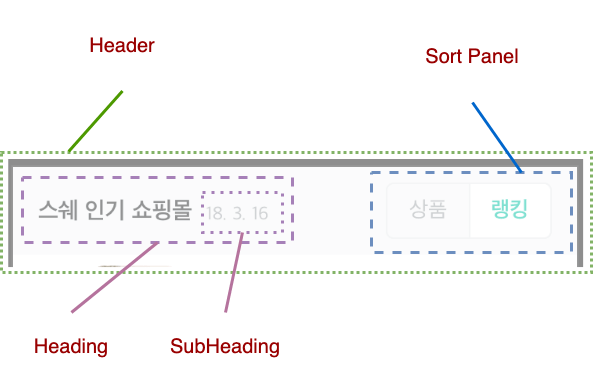
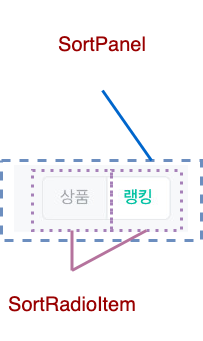
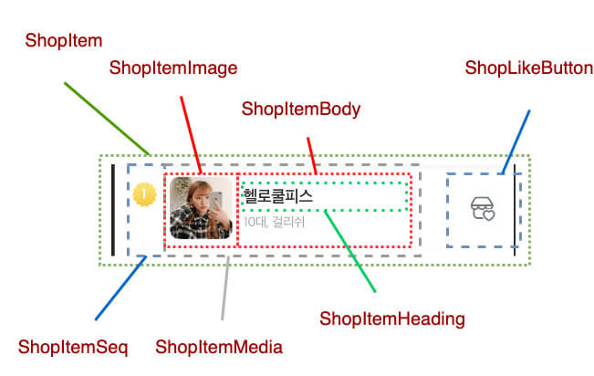
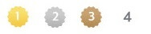

# User Interface Design - 2. 기능 분석

화면 내 영역 분석이 끝났으므로 추출된 컴포넌트에 기능을 넣어 줄 차례 입니다.

이번에도 잘 따라와 주시기 바랍니다!

## 진행 순서

이 작업은 아래와 같은 순서로 이뤄집니다.

1. 컴포넌트 Props 분석
2. 컴포넌트 Props 정리
3. Class Diagram 작성
4. 연관관계 작성

## 컴포넌트 Props 분석

사용될 컴포넌트에 어떤 Props가 있을지 생각 해 보신게 있나요?

아래 시안을 다시 확인하며 함께 확인 해 보겠습니다.

### 헤더 컴포넌트

아래에 추출된 헤더 컴포넌트가 있습니다.

필요한 Props들을 한번 찾아보겠습니다.

무엇을 찾으셨나요?

찾은 것을 나열 해 보겠습니다.

- Header : ~~음.. 뭐 딱히 없음~~
- Heading
  - 제목
- SubHeading
  - 보조 제목
- SortPanel : ~~역시 없음~~
- SortRadioItem
  - 레이블
  - 선택 상태
  - 상태 변화 알림

### 아이템 컴포넌트

이번엔 아이템 컴포넌트 입니다.

마찬가지로 Props들을 찾아 보겠습니다.

- ShopItem : ~~딱히?~~
- ShopItemSeq
  - 번호 (순위별 디자인이 다름)
- ShopItemMedia : ~~흐음..?~~
- ShopItemImage
  - 이미지 경로
- ShopItemBody
  - 설명글
- ShopItemHeading
  - 아이템 제목
- ShopLikeButton
  - 활성화 여부
  - 클릭 이벤트

어때요? 제가 찾은거랑 같은가요?

더 이상 없다면...? 넵! 끝이네요 🙂

## 컴포넌트 Props 정리

다음 순서로, 찾게된 컴포넌트의 각 Props들을 영어로 풀어 보겠습니다.

왜 영어냐구요? 아시면서.. 🤣

먼저 Props가 별도로 필요한 컴포넌트만 아래에 쭉 나열 해 보겠습니다.

- Heading
  - ~~제목~~ --> `title`
- SubHeading
  - ~~보조 제목~~ --> `subTitle`
- SortRadioItem
  - ~~레이블~~ --> `label`
  - ~~선택 상태~~ --> `checked`
  - ~~상태 변화 알림~~ --> `onChange`
- ShopItemSeq
  - ~~번호~~ --> `seq` (순위별 디자인이 다름)
- ShopItemImage
  - ~~이미지 경로~~ --> `imageUrl`
- ShopItemBody
  - ~~설명글~~ --> `desc`
- ShopItemHeading
  - ~~아이템 제목~~ --> `title`
- ShopLikeButton
  - ~~활성화 여부~~ --> `active`
  - ~~클릭 이벤트~~ --> `onClick`

다음으로 React 기준으로 굳이 props 가 아니고 children 으로 넘겨도 되는 것을 구분 해 보겠습니다.

어떤게 있을까요? 제가 보기엔 아래와 같은 사례들이 발견 됩니다.

- Heading.title
- SubHeading.subTitle
- SortRadioItem.label
- ShopItemBody.desc
- ShopItemHeading.title

이들의 공통점으로 어떤게 보이시나요?

제가 대신 답을 드리자면, `주는것 그대로 그냥 출력하는 것들` 입니다.

### 양념 첨가: 관심사 분리

> 엇! 그럼 ShopItemSeq.seq 는 뭔가요? 이것도 그대로 출력하는데..

..라는 질문이 있을겁니다.

`ShopItemSeq` 컴포넌트 역시 받은것 그대로 출력하지만 약간 다른게,

시안을 보시면 1~3 번까지는 출력 디자인이 다릅니다.

그래서 `어떻게 출력할지 값을 비교 하는 UI 로직` 이 필요하기에 별도 Props로 받는 것이 바람직하다 판단 됩니다.

> 이 Props를 children 으로 줄 경우 불가능 한 것은 아니나,
> 별도 타입 검사와 복잡한 절차를 거쳐야 하기 때문에
> 우리가 목표로 하는 단순하고 무식한 컴포넌트(`Simple Dumb Component`)와 거리가 멀어지게 됩니다.

이는 관심사 분리(Separation of Concerns)의 한 종류 입니다.

UI 컴포넌트 입장에선 seq Props에 따라 어떻게 출력할지 매우 관심이 많습니다.

그러나 seq Props를 제공하는 Model 입장에선 `응? 난 자료만 잘 주면 되는거 아니야?` ..가 됩니다.

엇! 갑자기 뜬금없이 `Model` 튀어 나왔습니다만, 여기서 모델은 `UI Model` 을 말합니다.

잊지 마세요! 우린 `Presentation Model Pattern` 을 사용하고 있습니다.

즉 컴포넌트의 각종 Props에 값을 쥐어 주는 것도 결국 `UI Model` 의 역할인 것입니다!

> 엇! SubHeading 은 시안 보니 날짜가 적히는데 이건 어쩔건가요?

음.. 그건 모델이 알아서 줄것입니다.

SubHeading 이 Date 객체를 받거나 별도 날짜형 모델을 받아서 스스로 포맷팅(formatting) 처리를 하도록 맡길 수 있으나 그러기엔 유연성이 떨어진다 판단 됩니다.

그럼 어떤걸 기준으로 판단해야 할까요?

앞서 말씀드린 `관심사 분리`를 기준으로 판단 합니다.

이는 다음과 같은 사례를 들어 비교 해 보면 알 수 있습니다.

1. 스스로 포맷팅 한다
   - Model 은 `date` 를 가지고 있고 이를 SubHeading 에 던져주면 컴포넌트가 변환해서 출력
2. Model 에서는 이미 변환된 문자열만 준다
   - Model 은 그냥 `subTitle` 이라는 필드만 가지고 있고 SubHeaing 은 단순히 출력만 한다.
   - 이 때 subTitle 변환값은 아키텍처 기준, `Data Manipulator` 가 알아서 바꿔준다.

자, 1번과 2번의 사례가 있습니다.

이제 SubHeading 의 내용을 회사의 요청에 따라 날짜가 아니라 `누적 이용자수` 로 바꾼다 가정하겠습니다.

1번의 사례에선 어떤가요?

`Model 뿐만 아니라 컴포넌트, 변환기 까지 모두 바꿔`줘야 합니다.

할 일이 좀 많겠죠? 😅

2번은 어떤가요?

그냥 `변환기에서 텍스트만 바꿔`주면 됩니다!

어떻습니까? 어느게 나을까요?

2번이 낫다고 판단 되신다면 `관심사 분리`의 중요성을 이해 하신겁니다!

이렇게 변화에 대한 수용 시, 다른 계층과의 관계에 있어 조금이라도 적게 변경 되는 방향으로 선택하시면 됩니다.

### 목록형 입력기 살펴보기

`SortRadioItem` 컴포넌트는 List 형태의 Radiobutton 입니다.

List 형태의 Checkbox 나 Radiobutton 은 각각이 가진 고유의 값을 이용하게 됩니다.

이 중 Radiobutton 은 여러개 중 1가지만 선택할 수 있으며

Checkbox 는 여러개 다중 선택이 가능합니다.

따로 이렇게 언급하는 까닭은, 이 두가지 유형이 공통점이 있기에 짚고 넘어갈 필요가 있기 때문 입니다.

그 공통점이란 각 Input Item 을 만드는 `List 컴포넌트에서 체크됨(checked) 상태를 관리 한다`는 점 입니다.

이 중 `Raidio Button List`는 외부에서 사용하게 되면 선택된 1가지 값만을 넘겨주게 됩니다.

Model 입장에선 선택된 값에 관심이 있지, 이 Radio Button 의 레이블(label) 이나 체크된 상태 같은 것엔 관심이 없기 때문입니다.

그래서 `SortRadioItem` 과 이들을 제어하는 `SortPanel` 은 아래와 같이 추가적인 Props 정의가 필요합니다.

- SortPanel
  - sort : 하위 Input Item 에 넘겨주고 checked 를 제어할 때 쓰일 정렬값
  - onSortChange : 정렬값이 변경 되었을 때 알려줄 이벤트
- SortRadioItem
  - value : 자신이 checked 되었을 때 알려줄 값
  - checked : 체크됨 여부
  - onChange : 체크 되었을 때 알려줄 이벤트

이렇게 SortPanel 에서 정렬과 관련 이벤트를 가지고 있으면, SortPanel 을 이용하는 외부에서는 내부 Radiobutton 에 대해 알지 못해도 됩니다.

만에 하나, Radiobutton 이 아니라 Selectbox 나 Dropdown-list 로 변경되더라도 SortPanel을 사용하는 외부에서는 관심이 없으므로 코드 변경도 필요 없게 됩니다.

즉 `관심사 분리`가 이뤄집니다.

### 목록형 컴포넌트 살펴보기

같은 방법으로 `ShopItem` 도 함께 보겠습니다.

ShopItem 은 좋아요 버튼 기능을 함께 내포하고 있으며

동시에 각종 다양한 정보를 표현하고 있습니다.

이런 정보와 버튼 이벤트를 받아들이려면 이 역시 Props 가 필요합니다.

- ShopItem
  - item : 표현될 각종 자료가 담긴 객체값 (Value Object)
  - onLikeChange : 좋아요 버튼을 눌렀을 때 발생될 이벤트

아까 위에서 확인 했던 `Radio Button List` 와 같은 사례가 아닌

지금처럼 모든 목록내 항목들에 대하여 신경써 줘야 할 경우엔

추가적으로 `index` 를 넘겨줄 필요가 있습니다.

이유는 "Item 에서 입력이 이뤄지면 본래 제공된 List 의 몇번째 요소의 것인지를 스스로 알 방법이 없기 때문" 입니다.

물론 가능한 방법이 있습니다만 제 경험상 어디선가 굉장히 복잡해지는 경우가 매우 많았습니다.

그래서 아래와 같이 자신이 소속된 index 값을 함께 넘겨주길 권장합니다.

- ShopItem
  - index : 컴포넌트의 위치값
  - item
  - onLikeChange

### 이제 끝인가요? 까도 까도 계속 나오는 느낌이..

네! 더 있습니다.

다만 여기서 모두 말하기엔 여러분들이 혼란스러울 수 있으므로 남은 것들은 클래스 다이어그램을 직접 그리면서 확인하고 설명 드리겠습니다.

### 조사 마무리

위에 언급된 children 및 추가된 Props 까지 확인된 컴포넌트들을 정리하자면 다음과 같습니다.

children 은 _`이탤릭체`_ 로 구분 해 두었습니다.

- Heading
  - ~~제목~~ --> ~~title~~ --> _`children`_
- SubHeading
  - ~~보조 제목~~ --> ~~subTitle~~ --> _`children`_
- SortPanel
  - `sort`
  - `onSortChange`
- SortRadioItem
  - `value`
  - ~~레이블~~ --> ~~label~~ --> _`children`_
  - ~~선택 상태~~ --> `checked`
  - ~~상태 변화 알림~~ --> `onChange`
- ShopItem
  - `index`
  - `item`
  - `onLikeChange`
- ShopItemSeq
  - ~~번호~~ --> `seq` (순위별 디자인이 다름)
- ShopItemImage
  - ~~이미지 경로~~ --> `imageUrl`
- ShopItemBody
  - ~~설명글~~ --> ~~desc~~ --> _`children`_
- ShopItemHeading
  - ~~아이템 제목~~ --> ~~title~~ --> _`children`_
- ShopLikeButton
  - ~~활성화 여부~~ --> `active`
  - ~~클릭 이벤트~~ --> `onClick`

그럼 다음으로 쓩~!!
