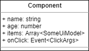
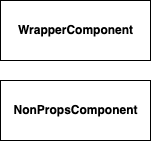

# User Interface Design - 2. 컴포넌트 설계

화면 내 영역 분석이 끝났으므로 추출된 컴포넌트에 기능을 넣어 줄 차례 입니다.

이번에도 잘 따라와 주시기 바랍니다!

## 진행 순서

이 작업은 아래와 같은 순서로 이뤄집니다.

1. 컴포넌트 Props 분석
2. 컴포넌트 Props 정리
3. Class Diagram 작성
4. 연관관계 작성

## 컴포넌트 Props 분석

사용될 컴포넌트에 어떤 Props가 있을지 생각 해 보신게 있나요?

아래 시안을 다시 확인하며 함께 확인 해 보겠습니다.

### 헤더 컴포넌트

아래에 추출된 헤더 컴포넌트가 있습니다.

필요한 Props들을 한번 찾아보겠습니다.


무엇을 찾으셨나요?

찾은 것을 나열 해 보겠습니다.

- Header : ~~음.. 뭐 딱히 없음~~
- Heading
  - 제목
- SubHeading
  - 보조 제목
- SortPanel : ~~역시 없음~~
- SortRadioItem
  - 레이블
  - 선택 상태
  - 상태 변화 알림

### 아이템 컴포넌트

이번엔 아이템 컴포넌트 입니다.

마찬가지로 Props들을 찾아 보겠습니다.


- ShopItem : ~~딱히?~~
- ShopItemSeq
  - 번호 (순위별 디자인이 다름)
- ShopItemMedia : ~~흐음..?~~
- ShopItemImage
  - 이미지 경로
- ShopItemBody
  - 설명글
- ShopItemHeading
  - 아이템 제목
- ShopLikeButton
  - 활성화 여부
  - 클릭 이벤트

어때요? 제가 찾은거랑 같은가요?

더 이상 없다면...? 넵! 끝이네요 🙂

## 컴포넌트 Props 정리

다음 순서로, 찾게된 컴포넌트의 각 Props들을 영어로 풀어 보겠습니다.

왜 영어냐구요? 아시면서.. ~~(웃음)~~

Props가 별도로 필요한 컴포넌트만 아래에 쭉 나열 해 보겠습니다.

- Heading
  - ~~제목~~ --> `title`
- SubHeading
  - ~~보조 제목~~ --> `subTitle`
- SortRadioItem
  - ~~레이블~~ --> `label`
  - ~~선택 상태~~ --> `checked`
  - ~~상태 변화 알림~~ --> `onChange`
- ShopItemSeq
  - ~~번호~~ --> `seq` (순위별 디자인이 다름)
- ShopItemImage
  - ~~이미지 경로~~ --> `imageUrl`
- ShopItemBody
  - ~~설명글~~ --> `desc`
- ShopItemHeading
  - ~~아이템 제목~~ --> `title`
- ShopLikeButton
  - ~~활성화 여부~~ --> `active`
  - ~~클릭 이벤트~~ --> `onClick`

다음으로 React 기준으로 굳이 props 가 아니고 children 으로 넘겨도 되는 것을 구분 해 보겠습니다.

어떤게 있을까요? 제가 보기엔 아래와 같은 사례들이 발견 됩니다.

- Heading.title
- SubHeading.subTitle
- SortRadioItem.label
- ShopItemBody.desc
- ShopItemHeading.title

이들의 공통점으로 어떤게 보이시나요?

제가 대신 답을 하자면 `주는것 그대로 그냥 출력하는 것들` 입니다.

### 양념 첨가: 관심사 분리

> 엇! 그럼 ShopItemSeq.seq 는 뭔가요? 이것도 그대로 출력하는데..

..라는 질문이 있을겁니다.

`ShopItemSeq` 컴포넌트 역시 받은것 그대로 출력하지만 약간 다른게,

시안을 보시면 1~3 번까지는 출력 디자인이 다릅니다.

그래서 `어떻게 출력할지 값을 비교 하는 UI 로직` 이 필요하기에 별도 Props로 받는 것이 바람직하다 판단 됩니다.

> 이 Props를 children 으로 줄 경우 불가능 한 것은 아니나,
> 별도 타입검사와 복잡한 절차를 거쳐야 하기 때문에
> 우리가 목표로 하는 단순하고 무식한 컴포넌트(`Simple Dumb Component`)와 거리가 멀어지게 됩니다.

이는 관심사 분리(Separation of Concerns)의 한 종류 입니다.

UI 컴포넌트 입장에선 seq Props에 따라 어떻게 출력할지 매우 관심이 많습니다.

그러나 seq Props를 제공하는 Model 입장에선 `응? 난 자료만 잘 주면 되는거 아니야?` ..가 됩니다.

엇! 갑자기 뜬금없이 `Model` 튀어 나왔습니다만, 여기서 모델은 `UI Model` 을 말합니다.

잊지 마세요! 우린 `Presentation Model Pattern` 을 사용하고 있습니다.

즉 컴포넌트의 각종 Props에 값을 쥐어 주는 것도 결국 `UI Model` 의 역할인 것입니다!

### 조사 마무리

위에 언급된 children 으로 빠지는 Props까지 정리하자면 다음과 같습니다.

children 은 _`이탤릭체`_ 로 구분 해 두었습니다.

- Heading
  - ~~제목~~ --> ~~title~~ --> _`children`_
- SubHeading
  - ~~보조 제목~~ --> ~~subTitle~~ --> _`children`_
- SortRadioItem
  - ~~레이블~~ --> ~~label~~ --> _`children`_
  - ~~선택 상태~~ --> `checked`
  - ~~상태 변화 알림~~ --> `onChange`
- ShopItemSeq
  - ~~번호~~ --> `seq` (순위별 디자인이 다름)
- ShopItemImage
  - ~~이미지 경로~~ --> `imageUrl`
- ShopItemBody
  - ~~설명글~~ --> ~~desc~~ --> _`children`_
- ShopItemHeading
  - ~~아이템 제목~~ --> ~~title~~ --> _`children`_
- ShopLikeButton
  - ~~활성화 여부~~ --> `active`
  - ~~클릭 이벤트~~ --> `onClick`

## 클래스 다이어그램 작성

이름과 Props가 모두 정해졌으니 다어그램으로 그려 보겠습니다.

가급적 첫 페이지에서 언급한 UML 관련글을 먼저 오시길 권해드립니다.

### 기초

클래스 다이어그램의 기본적인 구조는 다음과 같습니다.


좌측이 클래스(Class), 우측이 인터페이스(Interface) 입니다.

이를 TypeScript 코드로 옮기면 다음과 같습니다.

```ts
class ClassName {
  property: Type;
  method(): Type {
    // codes...
  }
}

interface InterfaceName {
  property: Type;
  method: () => Type;
}
```

일반적으론 인터페이스엔 property 가 붙지 않으나 프론트엔드에서 쓰이는 `TypeScript` 는 인터페이스에 property 를 허용하고 있으며 이를 활발히 활용하고 있으므로 함께 사용하는 방향으로 언급 하겠습니다.

또한 컴포넌트의 Props는 아래와 같이 별도 모델을 바라보도록 작성 합니다.


Props 는 위와 같이 `이름(Name)`, `속성(Attribute)`, `이벤트(Event)` 순으로 나뉘어져 있습니다.

속성중 배열(Array)이 있을 경우 위와 같이 Array 에 Generic 선언합니다.

단, 작성자 본인만 쓰고 말 것이며 스스로 명확히 구분 할 수 있다면 bracket(`[` 과 `]`) 으로 대신해도 됩니다.

이벤트는 그 명칭이 반드시 접두어 `on` 으로 시작되어야 하며 Type은 `Event` 에 `Argument Model (접미사 Args)`을 Generic 으로 표현 합니다.

만약 별도로 넘겨주는게 없다면 `void` 로 명시 해 줍니다.

메서드(method)가 없는 컴포넌트를 작성한다면 다음을 참고 합니다.



한편, 단순한 래퍼(Wrapper) 역할 이거나 props 및 method 가 없는 컴포넌트라면 다음과 같이 작성합니다.



보시다시피 그냥 사각형에 이름만 덩그러니 주시면 됩니다 🙂

## 연관관계 작성
