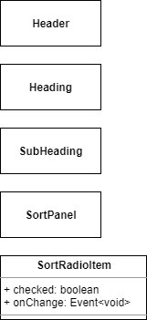
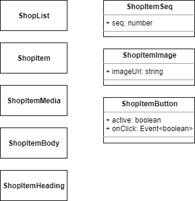

## 클래스 다이어그램 작성

이름과 Props가 정해졌으니 다어그램으로 그려 보겠습니다.

가급적 첫 페이지에서 언급한 UML 관련글을 보고 오시길 권해드립니다.

### 기본 구조

클래스 다이어그램의 기본적인 구조는 다음과 같습니다.


좌측이 클래스(Class), 우측이 인터페이스(Interface) 입니다.

이를 TypeScript 코드로 옮기면 다음과 같습니다.

```ts
class ClassName {
  property: Type;
  method(): Type {
    // codes...
  }
}

interface InterfaceName {
  property: Type;
  method: () => Type;
}
```

일반적으론 인터페이스엔 property 가 붙지 않으나 프론트엔드에서 쓰이는 `TypeScript` 는 인터페이스에 property 를 허용하고 있고 이를 활발히 활용하고 있으므로 함께 사용하는 방향으로 언급 하겠습니다.

또한 컴포넌트의 Props는 아래와 같이 별도 모델을 바라보도록 작성 합니다.


Props 는 위와 같이 `이름(Name)`, `속성(Attribute)`, `이벤트(Event)` 순으로 나뉘어져 있습니다.

위 다이어그램은 속성과 이벤트가 구분되어 있지만 Props 의 이벤트에 한해서만 다음과 같이 이벤트와 속성을 하나의 공간에 묶는 것을 허용 합니다.


허허.. 근데 컴포넌트 하나 작성할 때 마다 이러는건 왠지 번거롭습니다.

그래서 Component 와 관련 Props 를 합쳐서 아래와 같이 작성하도록 합시다.


좀 간단해 졌나요?

한가지 주의 하실점은, 이렇게 합쳐놨어도 React Component 기준, 아래와 같이 Props 사용 시엔 여전히 내부 멤버인 `props` 에 접근하여 사용해야 된다는 점 입니다.

```tsx
interface Props {
  name: string;
  age: number;
  items: SomeUiModel[];
  onClick: (args: ClickArgs) => void;
}

const Component: FC<Props> = (props) => {
  const {
    name,
    age,
    items,
    onClick,
  } = props;

  return (
    // codes...
  );
};
```

즉 업무의 편의상 변경(Customizing) 했음을 잊지 마세요!

한편, 특정 컴포넌트의 Props 를 다른 컴포넌트에서 가져다 동일하게 사용하는 경우엔 아래와 같이 다시 인터페이스만 추출하여 이를 서로 공유하는 형태로 나타냅니다.


### 세부사항

Props 내용중 배열(Array)이 있을 경우 위와 같이 Array 에 Generic 선언합니다.

단, 작성자 본인만 쓰고 말 것이며 스스로 명확히 구분 할 수 있다면 bracket(`[` 과 `]`) 으로 대신해도 됩니다.


이벤트의 Type은 `Event` 에 `Argument Model (접미사 Args)`을 Generic 으로 표현 합니다.

만약 별도로 넘겨주는게 없다면 아래와 같이 `void` 로 명시 해 줍니다.


메서드(method)가 없는 컴포넌트를 작성한다면 다음을 참고 합니다.

Carousel 이나 Scroller 같이 외부에서 제어할 일이 없는 표현 컴포넌트(Presentational Component)는 보통 아래와 같이 작성하게 될 것입니다.


### 주고받기가 없는 컴포넌트

단순한 래퍼(Wrapper) 역할 이거나 props 및 method 가 없는 컴포넌트라면 다음과 같이 작성합니다.


보시다시피 그냥 사각형에 이름만 덩그러니 주시면 됩니다 🙂

### 컴포넌트 그리기

조사가 끝난 컴포넌트 대상을 다시 한번 나열해 보겠습니다.

- Header
  - Heading
    - _`children`_
    - SubHeading
      - _`children`_
  - SortPanel
    - `sort`
    - `onSortChange`
    - SortRadioItem
      - _`children`_
      - `value`
      - `checked`
      - `onChange`
- ShopList
  - ShopItem
    - `index`
    - `item`
    - `onLikeChange`
    - ShopItemSeq
      - `seq`
    - ShopItemMedia
      - ShopItemImage
        - `imageUrl`
      - ShopItemBody
        - _`children`_
        - ShopItemHeading
          - _`children`_
    - ShopLikeButton
      - `active`
      - `onClick`

먼저 Header Section 소속 컴포넌트 입니다.



다음은 List Section 소속 컴포넌트 입니다.



## 연관관계 작성
