# User Interface Design - 3. 클래스 다이어그램 작성

이름과 Props가 정해졌으니 다어그램으로 그려 보겠습니다.

가급적 첫 페이지에서 언급한 UML 관련글을 보고 오시길 권해드립니다.

## 진행 순서

작업 순서는 다음과 같습니다.

1. 컴포넌트 그리기
   - 조사된 내용을 바탕으로 컴포넌트의 클래스 다이어그램을 그립니다.
2. 모델 그리기
   - 컴포넌트를 그리는 도중 발견되거나 추가된 UI 모델을 그립니다.
3. 연관 관계 그리기
   - 각 컴포넌트와 UI 모델간의 연관 관계(association)를 그립니다.

## 기본 구조

클래스 다이어그램의 기본적인 구조는 다음과 같습니다.

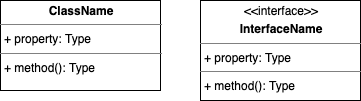

좌측이 클래스(Class), 우측이 인터페이스(Interface) 입니다.

이를 TypeScript 코드로 옮기면 다음과 같습니다.

```ts
class ClassName {
  property: Type;
  method(): Type {
    // codes...
  }
}

interface InterfaceName {
  property: Type;
  method: () => Type;
}
```

일반적으론 인터페이스엔 property 가 붙지 않으나 프론트엔드에서 쓰이는 `TypeScript` 는 인터페이스에 property 를 허용하고 있고 이를 활발히 활용하고 있으므로 함께 사용하는 방향으로 언급 하겠습니다.

또한 컴포넌트의 Props는 아래와 같이 별도 모델을 바라보도록 작성 합니다.

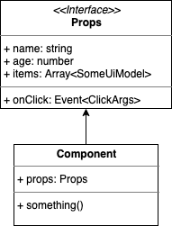

Props 는 위와 같이 `이름(Name)`, `속성(Attribute)`, `이벤트(Event)` 순으로 나뉘어져 있습니다.

위 다이어그램은 속성과 이벤트가 구분되어 있지만 Props 의 이벤트에 한해서만 다음과 같이 이벤트와 속성을 하나의 공간에 묶는 것을 허용 합니다.

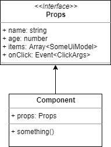

허허.. 근데 컴포넌트 하나 작성할 때 마다 이러는건 왠지 번거롭습니다.

그래서 Component 와 관련 Props 를 합쳐서 아래와 같이 작성하도록 합시다.

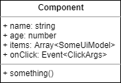

좀 간단해 졌나요?

한가지 주의 하실점은, 이렇게 합쳐놨어도 React Component 기준, 아래와 같이 Props 사용 시엔 여전히 내부 멤버인 `props` 에 접근하여 사용해야 된다는 점 입니다.

```tsx
interface Props {
  name: string;
  age: number;
  items: SomeUiModel[];
  onClick: (args: ClickArgs) => void;
}

const Component: FC<Props> = (props) => {
  const {
    name,
    age,
    items,
    onClick,
  } = props;

  return (
    // codes...
  );
};
```

즉 업무의 편의상 변경(Customizing) 했음을 잊지 마세요!

한편, 특정 컴포넌트의 Props 를 다른 컴포넌트에서 가져다 동일하게 사용하는 경우엔 아래와 같이 다시 인터페이스만 추출하여 이를 서로 공유하는 형태로 나타냅니다.

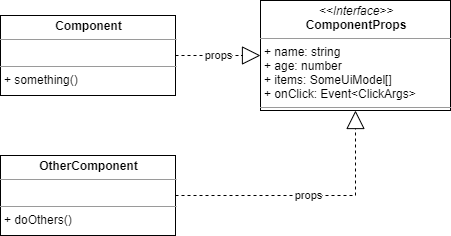

### 세부사항

Props 내용중 배열(Array)이 있을 경우 위와 같이 Array 에 Generic 선언합니다.

단, 작성자 본인만 쓰고 말 것이며 스스로 명확히 구분 할 수 있다면 bracket(`[` 과 `]`) 으로 대신해도 됩니다.

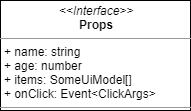

이벤트의 Type은 `Event` 에 `Argument Model (접미사 Args)`을 Generic 으로 표현 합니다.

만약 별도로 넘겨주는게 없다면 아래와 같이 `void` 로 명시 해 줍니다.

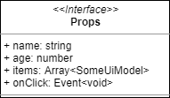

메서드(method)가 없는 컴포넌트를 작성한다면 다음을 참고 합니다.

Carousel 이나 Scroller 같이 외부에서 제어할 일이 없는 표현 컴포넌트(Presentational Component)는 보통 아래와 같이 작성하게 될 것입니다.

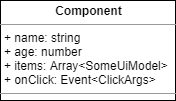

### children 을 포함하는 컴포넌트

받아들이는 children 이 React 기준, 컴포넌트를 여럿 가질 수 있는 Wrapper 형태라면 `NodeList` 를 타입으로 줍니다.

반면 하나의 요소만 가지며 타입이 정해져 있다면 오른쪽 예시처럼 `타입을 명시` 해 줍니다.

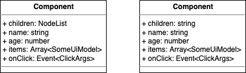

특정 컴포넌트에 children 이 있을 경우 아래와 같은 코드가 가능합니다.

아래 예제에서는 `<Wrapper>` 컴포넌트를 가리킵니다.

```tsx
const Example: FC<Props> = () => {
  return (
    <Wrapper>
      {/* Wrapper 는 children 을 가질 수 있습니다. */}
      <Picture src="www.image.org/123.png" />
      <Paragraph>blahblah..</Paragraph>
    </Wrapper>
  );
};
```

만약 컴포넌트 내부에서 children 을 별도로 핸들링 하지 않는다면 위 예시의 하위 컴포넌트는 아무런 의미가 없게 될 것입니다. ~~(당연한 말씀)~~

### Props가 없는 컴포넌트

단순한 래퍼(Wrapper) 역할 이거나 props 및 method 가 없는 컴포넌트라면 다음과 같이 작성합니다.

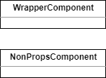

보시다시피 그냥 사각형에 이름만 덩그러니 주시면 됩니다 🙂

## 컴포넌트 그리기

조사가 끝난 컴포넌트 대상을 다시 한번 나열해 보겠습니다.

먼저 Header Section 소속 컴포넌트 입니다.

- Header
  - _`children`_
  - `title`
  - `subTitle`
- Heading
  - _`children`_
- SubHeading
  - _`children`_
- SortPanel
  - `sort`
  - `onSortChange`
- SortRadioItem
  - _`children`_
  - `value`
  - `checked`
  - `onChange`


Header 컴포넌트는 사용 시 SortPanel 같은 외부 컴포넌트를 감싸 주어야 하므로 children 타입을 `NodeList` 로 두었습니다.

반면 다른 children 이 필요한 곳은 `문자열(string)` 로 고정 하였습니다.

SortPanel 의 `onSortChange` 이벤트는 전달 인자값(Event Arguments)을 문자열로 주도록 했습니다.

검색 필터 (Search Filter) 기능이 복잡해 진다면 `Composite Pattern` 을 쓰기 위해 필드명과 값을 묶어서 보내주는게 맞겠지만, 여기에선 본 기능이 매우 단순하므로 변경된 값만을 넘기기 위함 입니다.

다음은 List Section 소속 컴포넌트 입니다.

- ShopList
  - `items`
  - `onLikeChange`
- ShopItem
  - `index`
  - `item`
  - `onLikeChange`
- ShopItemSeq
  - `seq`
- ShopItemMedia
  - `imageUrl`
  - `title`
  - `desc`
- ShopItemImage
  - `imageUrl`
- ShopItemBody
  - _`children`_
- ShopItemHeading
  - _`children`_
- ShopLikeButton
  - `active`
  - `onClick`


ShopList 및 ShopItem 에서 쓰이는 UI Model 은 `ShopListItemUiModel` 로 두었습니다.

아직 어떤 필드가 들어갈지 정의하진 않았지만, 지금까지 분석하고 다이어그램을 그려봤다면

대략 어떠한 항목이 들어갈지 짐작은 가실겁니다. 🙂

덧붙여 `좋아요`가 변경되었을 때 전달 할 이벤트 객체는 `ShopLikeChangeArgs` 로 명명 하였습니다.

## 모델 작성

이번 단계에선 언급된 UI 모델을 작성 해 볼것입니다.

그 전에 각 모델에 필요한 field 를 정리 해 보겠습니다.

- ShopListItemUiModel
  - ~~seq~~
  - `id`
  - imageUrl
  - title
  - desc
  - activeLike
- ShopLikeChangeArgs
  - index
  - `id`
  - active

이 중 `ShopListItemUiModel.seq` 는 제외 할 것입니다.

이유는 ShopList 컴포넌트 안에서 순회(looping)할 때 참조 할 수 있는 **index** 값을 이용하면 충분하기 때문입니다.

`id` 항목이 추가 되었는데, 이건 List 형태의 컴포넌트 내부에 있는 Item 컴포넌트가 이벤트를 가질 경우, 각 아이템의 고윳값을 이벤트 객체로 넘겨주면 이 후 프로세스가 훨씬 수월해 지기 때문입니다.

그래서 **ShopListItemUiModel** 과 **ShopListItemUiModel** 2가지에 모두 `id` 가 들어갑니다.

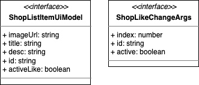

### 모델 분리

> 참고: 여기서 말하는 Model 이란 `DTO(Data Transfer Object)`, `VO(Value Object)` 를 의미합니다.

UI Model 은 컴포넌트에서 직접적으로 사용하는 모델 입니다.

다만, 그 안의 모든 필드를 상위 컴포넌트가 받아 들일지언정 하위 컴포넌트는 각자가 필요한 필드만 사용하기 마련입니다.

이에 따라 각 컴포넌트가 필요한 모델을 분리 해아하며 이러한 행위는 객체지향 5원칙 중 ISP(Interface Segregation Principle)를 지키는 일이 됩니다.

그럼 무엇을 어떻게 분리해야 할까요?

먼저 사용하는 컴포넌트를 들여다 볼 필요가 있습니다.

함께 그려낸 모델 다이어그램이 **ShopListItemUiModel** 과 **ShopListItemUiModel** 2가지 입니다.

그 중 **ShopListItemUiModel** 을 사용하는 컴포넌트는 어떤게 있을까요?

네! `ShopItem` 컴포넌트 입니다.

ShopItem 에 대한 컴포넌트 마크업은 다음과 같습니다.

```xml
<ShopItem>
  <ShopItemSeq />
  <ShopItemMedia>
    <ShopItemImage />
    <ShopItemBody>
      <ShopItemHeading />
    </ShopItemBody>
  </ShopItemMedia>
  <ShopLikeButton />
</ShopItem>
```

오오.. 😱 좀 많군요!

하지만 부담 가지지 말고 보십시요.

그리고 하나씩 필요한 필드를 넣어보겠습니다.

어떤 것 부터 넣어볼까요?

ShopItem 에 `item` 필드 부터 넣어보겠습니다.

```xml
<ShopItem item>
  <ShopItemSeq />
  <ShopItemMedia>
    <ShopItemImage />
    <ShopItemBody>
      <ShopItemHeading />
    </ShopItemBody>
  </ShopItemMedia>
  <ShopLikeButton />
</ShopItem>
```

다음은 각 하위 컴포넌트에 필요한 필드를 넣어보겠습니다.

각 아이템의 이미지와 제목, 설명을 추가 하겠습니다.

```xml
<ShopItem item>
  <ShopItemSeq />
  <ShopItemMedia>
    <ShopItemImage imageUrl />
    <ShopItemBody desc>
      <ShopItemHeading title />
    </ShopItemBody>
  </ShopItemMedia>
  <ShopLikeButton />
</ShopItem>
```

위 내용에서 미디어 객체만 따로 떼어 보았습니다.

```xml
<ShopItemMedia>
  <ShopItemImage imageUrl />
  <ShopItemBody desc>
    <ShopItemHeading title />
  </ShopItemBody>
</ShopItemMedia>
```

이렇게 두고 보니 미디어 객체 담당인 `ShopItemMedia` 컴포넌트가 필요한 속성이 보이시나요?

imageUrl, desc, title, 이렇게 3가지가 되겠습니다.

이들 속성은 ShopItemMedia 컴포넌트가 받아들여서 하위 컴포넌트에 전달 해 줄겁니다.

그럼 이 컴포넌트의 Props 는 다음과 같은 형태로 코드가 이뤄지겠군요.

```ts
interface Props {
  imageUrl: string;
  desc: string;
  title: string;
}
```

하지만 우린 이 Props 를 ShopItemMedia 컴포넌트에서만 쓰게 놔두진 않을겁니다.

이유는 **ShopListItemUiModel** 과 필드가 겹치기 때문입니다.

단순히 UI 모델의 필드 일부분과 겹친다고 컴포넌트에서 분리한다 ...라?

선뜻 이해가 되지 않으실겁니다.

클린 아키텍처 (Clean Architecture)에 따르면 고수준 요소는 저수준 요소를 알지 못하게 하는 것이 원칙 입니다.

여기서 말하는 고수준엔 `Entity (엔티티)`가 포함되어 있으며 이 엔티티는 대표적으로 Model 을 의미 하기도 합니다. (100%는 아닙니다~)

생각해보세요!

UI Model 은 자신이 어디서 쓸지에 관심 있을까요?

넵. 없습니다.

마찬가지로 Props 로 쓰이는 모델도 사실 엔티티의 한 종류라 보시면 됩니다.

다만 편의상 컴포넌트 코드에 편입시켜 작성 할 뿐인 것이죠!

그런데 Props 의 필드 출처가 UI Model 이라면?

혹은 Props 가 UI Model 의 부분집합(Sub Set) 이라면?

이 코드는 어디에 있어야 할까요?

정답은 외부 model 관련 모듈 입니다!

그래서 위 Props 를 별도 Ui Model 로 분리하고 이름도 붙여줄겁니다.

이름은 뭘로 할까요?

미디어 객체를 대상으로 하고 있으니 `ShopItemMediaUiModel` 로 하겠습니다.

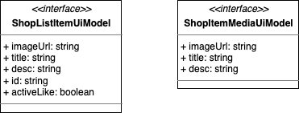

좌측이 처음 만들었던 모델, 우측이 새로 만들어진 모델 입니다.

좌측 모델은 우측 모델 기반으로 추가된 필드로 구성되어 있으므로 아래와 같이 상속 여부를 연관 시켜 줍니다.


추가로 좌측 모델 기준으로 우측 모델의 중복되는 필드는 제외 시켰습니다.

두 모델을 제외한 다른 다어그램간의 연관 관계는 다음 챕터에서 더 상세히 다룰겁니다.

지금까지 작성된 두 모델에 대한 예상되는 코드는 다음과 같습니다.

```ts
interface ShopItemMediaUiModel {
  imageUrl: string;
  title: string;
  desc: string;
}

interface ShopListItemUiModel extends ShopItemMediaUiModel {
  id: string;
  activeLike: boolean;
}
```

남은 이벤트 전달 객체인 **ShopLikeChangeArgs** 는 코드로 작성된다면 이렇게 되겠습니다.

```ts
interface ShopLikeChangeArgs {
  index: number;
  id: string;
  active: boolean;
}
```

자! 이제 함께 작성된 다이어그램을 쭉~ 나열해 보겠습니다.


작성하느라 수고 하셨습니다! 👍

## 정리하며

처음 UML 을 접하는 분들이 많을거라 판단하여 이 것이 실제 쓰일때의 코드를 다수 포함 시켜 설명 하였습니다.

다만 이것을 보시면서 `이러고 있을 시간에 그냥 코드 한줄 더 짜겠다` ..라고 생각 하실 수 있습니다.

이후에도 강조 하겠지만, 현재 실습 대상으로 삼은 디자인 시안은 매우 단순한 편입니다.

그래서 간단한 요청사항을 코드로 옮기는 것에 익숙한 분들은 답답하실 수 있어요.

하지만 그렇다고 처음부터 복잡한 것을 할순 없잖아요? 😅

앞서 언급 했듯이 지금 배워 나가는 내용은 이 후 복잡해지는 업무를 경험 하셨을 때 그 것을 좀 더 잘 풀어나가기 위한 방법 입니다.

다소 답답하더라도 끝까지, 묵묵히 따라와 주시기 바라겠습니다!

그럼 다음으로 쓩~!!
