# UI Component Design - 4. 연관관계 표현

작성된 클래스 다이어그램을 이용하여 상호간의 연관관계(association)를 그려 보겠습니다.

지금까지 다이어그램을 그려보았고 `이건 이렇게 저렇게 관계가 있을텐데` 라는 감이 잡히셨다면 좀 더 쉽게 접근 가능 하실겁니다.

## 하위 컴포넌트 연관 짓기

먼저 Header Section 부터 살펴 보겠습니다.

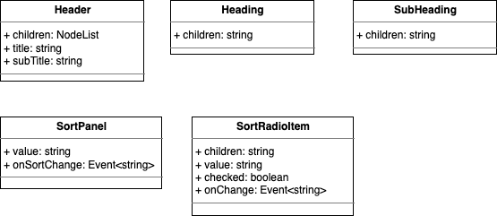

이들에 대한 컴포넌트 마크업은 다음과 같습니다.

```xml
<Header>
  <Heading>
    <SubHeading />
  </Heading>
  <SortPanel>
    <SortRadioItem />
    <SortRadioItem />
  </SortPanel>
</Header>
```

음.. 어떻게 연관시켜야 할까요? 🤔

이럴 땐 가장 큰 영역 부터 접근 하면 됩니다.

위의 컴포넌트 마크업 기준으로 `<Header>` 가 감싸는 대상은 무엇일까요?

바로 `<Heading>` 과 `<SortPanel>` 입니다.

바로 아래와 같이 Header 에서 Heading 과 SortPanel 로 화살표를 쭉 내려 보겠습니다.

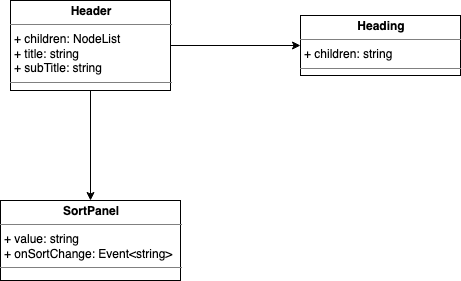

이렇게 화살표가 `[A]--->[B]` 와 같이 표현될 때 `A가 B를 필요로 한다` ..로 의미 부여가 됩니다.

이렇게 화살표는 항상 `필요한 방향` 으로 뻗어 나가야 합니다.

이렇게 한쪽이 다른 한쪽을 필요로 하는 것을 두고 `Direct Association (직접 연관)` 이라 합니다.

같은 방법으로 Header 와 SortPanel 도 연관 관계를 표현 해 보겠습니다.

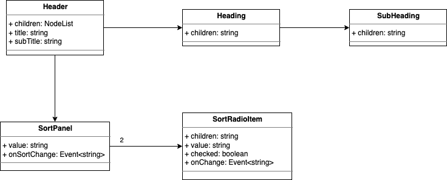

Heading 은 SubHeading 을 필요로 하고, SortPanel 은 SortRadioItem 을 필요로 합니다.

이 때 SortPanel 은 SortRadioItem 이 `2개 필요` 하므로 관련 화살표 부분에 `2` 라고 명시 해 두었습니다.

### 죽고 사는걸 함께하는 관계

일반적인 UI 컴포넌트는 자신의 하위 컴포넌트와 생사를 함께 합니다.

즉 생성(Construction) 단계에서 같이 만들어지며 파괴되어 메모리 소거(Destruction)될 때 함께 사라지는 관계 입니다.

이러한 관계를 `Composition(구성)` 이라 하며 클래스 다이어그램에서는 아래와 같이 표현 합니다.

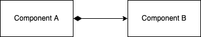

위 그림은 `Component A` 가 `Component B` 를 필요로 하는 관계를 그린 것 입니다.

이 때 사용처(Client)는 검은 마름모꼴을 쓰기에 저는 통칭 `Black Diamond` 라 부르기도 합니다.

한편 아래와 같은 React 코드가 있다고 가정 해 보겠습니다.

```tsx
const StyledComp = styled.span``;

const Sample: FC = () => {
  return <StyledComp>비둘기는 공룡의 후손이다</StyledComp>;
};

const Client: FC = () => {
  return <Sample />;
};
```

위 코드를 이용하여 연관관계를 그려 보겠습니다.


Client 는 Sample 만을 포함하여 사용하고 있고, Sample 은 StyleComp 만을 포함하여 사용하고 있습니다.

달리 말하자면 Client 는 Sample 이 `StyledComp` 를 사용하는지에 대하여 모르며 관심도 없습니다.

근데 다음과 같은 코드로 바뀌었다 가정하겠습니다.

```tsx
const StyledComp = styled.span``;

const Sample: FC = ({ children }) => {
  return <div>{children}</div>;
};

const Client: FC = () => {
  return (
    <Sample>
      <StyledComp>비둘기는 공룡의 후손이다</StyledComp>
    </Sample>
  );
};
```

Client 가 Sample 을 사용하되 StyledComp 를 직접 Sample 의 children 에 주입 해주는 모양새 입니다.

이들에 대한 관계는 어떻게 표현해야 할까요?

이건 다음과 같이 표현 가능합니다.

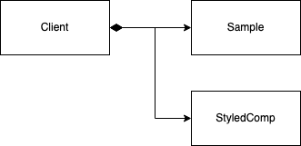

Client 가 Sample 과 StyledCompe 둘 다 직접적으로(directly) 사용하고 있으므로 하나의 블랙 다이아에 두개의 컴포넌트를 연결시킨 모습 입니다.

### 다시 Header Section 으로..

위에 언급된 Composition 으로 표현하면 다음과 같습니다.

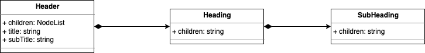

한편 헤더 영역의 컴포넌트가 쓰여지길 바라는 형태는 다음과 같습니다.

```xml
<Header title subTitle>
  <SortPanel value onSortChange />
</Header>
```

엇! 그런데 현재 그려진 컴포넌트 관계는 바라는 방향과 맞지 않아 보입니다.

그럼 고쳐 보겠습니다.

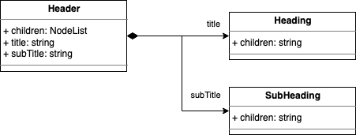

Header 의 props 인 title 과 subTitle 을 하위 컴포넌트에 전달 한다는 내용을 연관관계에 함께 표현 하였습니다.

이 때 아래와 같은 질문 사항이 있을거 같습니다.

> Heading 의 children 에 SubHeading 이 들어가는데 이건 어떻게 표현하나요?

SubHeading 의 직접적인 사용처가 Header 로 바뀌었으므로 Heading 은 자신의 children 으로 SubHeading 이 쓰이는지의 여부엔 관심이 없습니다.

그러므로 아래와 같이 표현할 수 있습니다.

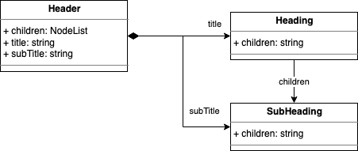

이 후 다양한 컴포넌트가 이렇게 children 으로 포함될 경우엔 관계를 표현하는 화살표가 많아지게 되므로 생략해도 무방합니다.

이제 SortPanel 도 연관 시켜 보겠습니다.

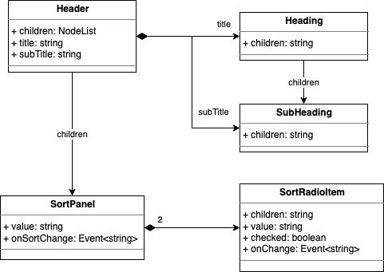

음.. 작성하긴 했는데 뭔가 빠진거 같지 않나요?

아마도 `SortPanel 의 value 를 전달하면 SortRadioItem 이 받아서 checked 상태를 표현`하는 이유일 것입니다.

checked 표현 여부에 대한 기준이 되는 비교값은 SortRadioItem 각자가 가진 value 가 될테지요.

이러한 상세한 내용이 다이어그램에 필요할까요?

흠.. 🤔

다이어그램 자체는 추상화된 내용이기 때문에 세부적인 것 까지는 기재하지 않습니다.

그래서 이런 것 까지 굳이(?) 필요하다면 주석으로 대신 합니다.

이런 절차에 익숙해진다면 굳이 없어도 되지만

다른 동료와의 의견 교류 도구로써 활용한다 가정하고 주석을 넣어 보겠습니다.

주석은 아래와 같이 추가하면 됩니다.

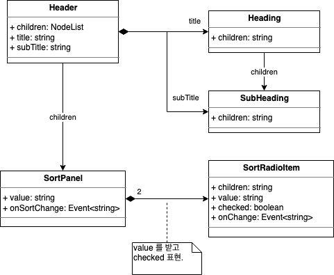

### List Section

다음으로 조금 더 복잡한 리스트 영역을 보겠습니다.

아래는 이전에 작성했던 다이어그램 입니다.

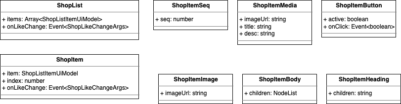

어떻게 연관 시킬지 감이 잡히시나요?

항상 큰 영역에서 부터 하위 컴포넌트로 뻗어 나가세요.

**마치 나무가지 처럼**요!

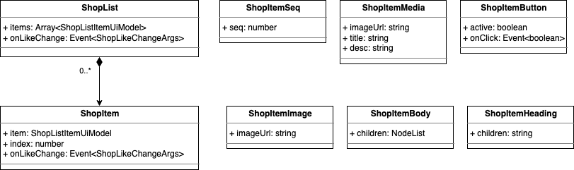

첫 단계로 ShopList 에서 ShopItem 을 연관 시켰습니다.

이들은 Composition 관계 이므로 블랙 다이아를 붙였고, Array 에 의해 그 개수가 좌우 되기에 `별표 - astrisk(*)`를 붙이나 제 개인적으론 잘 티가 안나서 `0..*` 와 같이 작성하는 것을 선호 합니다.

다음은 ShopItem 의 하위 컴포넌트에 연관 시키겠습니다.

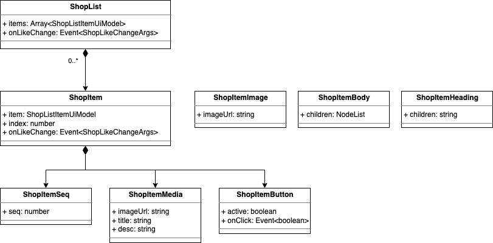

ShopItem 하위 컴포넌트는 모두 부모와 생사를 함께 하므로 블랙 다이아를 붙여 주었습니다.

다음은 ShopItemMedia 입니다.

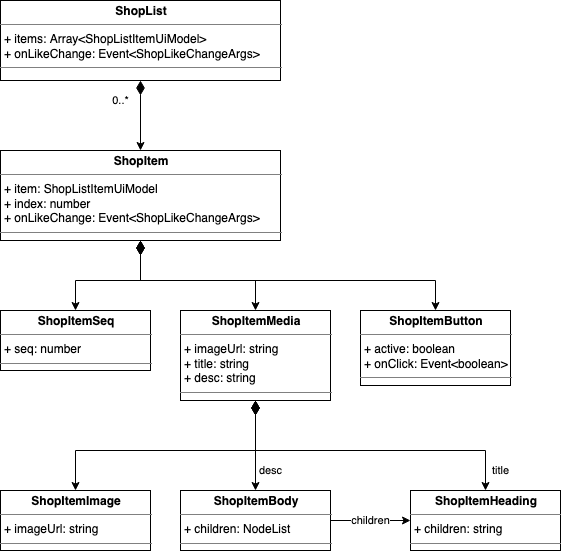

역시 UI 컴포넌트 들이니 블랙 다이아 가즈아~! 😆

이쯤 되니 뭔가 완성되는 느낌이 들어 뿌듯합니다!

그럼 다음으로 쓩~!!
