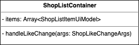
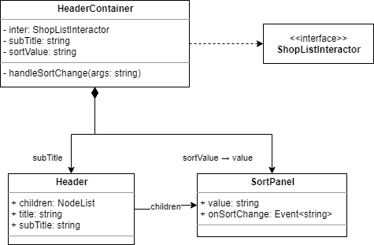

# UI Component Design - 5. 컨테이너 작성

UI가 포함된 프로젝트에서는 일반적으로 MVC 계통의 아키텍처를 업무에 응용하고 있습니다.

그 중 웹프론트엔드는 각 컴포넌트의 상태에 대한 관리자를 따로 두는 `Flux Architecture` 를 많이 응용 하고 있습니다.

우린 React 의 Context API 기반의 아키텍처를 이용하고 있지만 전체 상태를 총괄하는 단 하나의 Store 를 두지 않고 필요한 곳마다 State 를 두는,

굳이 명명하자면 `Lesser Flux` ..라 부를 수 있을까요.

~~나의 플럭스는 이렇지 않아~~

이하 현재 사용되는 방법을 통틀어 `FE 아키텍처`라 언급 하겠습니다.

## 진행순서

1. 사용처 추가
   - 작성된 최상위 컴포넌트를 도메인 업무에 이용하는 Container 를 추가 합니다.
   - Container 는 MVC 기준 Controller 역할을 맡습니다.
2. 스토어 연결
   - FE 아키텍처 기준, Context 를 제어하는 Interactor 를 Container 에 주입 시킵니다.

## 사용처에 대하여

Header 와 ShopList 에 대해서 정의는 끝났습니다.

근데 이들을 이용하는 사용처(Client)가 빠졌습니다.

> **알아두세요!**
>
> 사용처(Client)는 특정 기능을 사용하거나 필요로 하는 곳 입니다.
>
> 가령 Controller 가 있고 이들을 이용하는 Service 가 있다고 가정하면 Service 의 Client는 Controller 가 되는 것입니다.
>
> 따라서 Client는 위치에 따라 다르게 정의가 됩니다.

여기서의 사용처란 바로 컨테이너(Container) 컴포넌트 입니다.

그럼 컨테이너가 Header 와 ShopList 를 각각 이용하는 것을 다이어그램으로 표현해 보겠습니다.


props 로 자료가 전달되는 것은 생략 했습니다.

## 도메인 관심사

FE 아키텍처 관점에서 화면 출력에 대한 설계는 끝이 났습니다.

하지만 이들을 제어하는 컨트롤러가 필요합니다.

React 에서는 그 역할을 일반적으로 Container 가 맡고 있습니다.

Container 가 무엇이죠? 기억 하시나요?

네! `하나의 작은 업무가 완성되는 장소` 입니다.

이 `작은 업무`라 함은 하나의 도메인(Domain)을 뜻합니다.

다른 소프트웨어도 마찬가지겠지만, 한번 도메인이 정해지면 그 도메인을 이용하는 회사가 끝장(?) 나거나 관련 서비스가 망할때(!) 까지는 그 어떤 방법으로든 그 도메인은 사라지지 않고 회사와 함께 숨쉬게 됩니다.

다만, 사용하는 형태나 세부적인 구성요소의 차이점이 있을 뿐이지요.

즉 도메인은 지금껏 열심히 고민해 온 UI Component 가 어떻게 구성되어 업무를 수행할지

거~~~의 관심 없습니다. ~~(100%가 아님을 유의)~~

그렇다고 지금껏 한 것이 다 필요 없었다는 얘기가 아닙니다!

관심이 없을 뿐이지, 필요 없다고는 얘기 안했습니다! 😅

다시 돌아와서,

Container 를 컨트롤러로 둘 것인데 우선 `ShopList` 를 어떻게 제어할지 고민 해 보겠습니다.

## ShopListContainer 작성

ShopList 가 필요로 하는게 어떤게 있을까요?

바로 출력 때 필요한 자료 `items` 와 좋아요! ..를 눌렀을 때 이를 후속 처리 할 `onLikeChange` 에 대한 이벤트 핸들러 입니다.

ShopList 입장에선 이들 2개만 제공 해주면 됩니다.

간단하죠? 🙂

이들에 대하여 다이어그램을 그리자면 다음과 같습니다.



엇! 근데 이전에 그려왔던 다이어그램과 차이점이 보이실까요?

혹시 못보셨다면 클래스 멤버 좌측 기호가 `+(plus)` 가 아니라 `-(minus)` 인 것을 찾아 보세요!

찾아보신 이 기호는 접근 제한자(Access Modifier) 입니다.

`+` 는 공개된 것으로써 `public` 을 뜻하고, `-` 는 감춰져서 자기 자신만 쓸 수 있는 것이므로 `private` 입니다.

그럼 Container 는 이 items 와 핸들러를 어떻게 제어 해야 할까요?

내부에 뭔가가 있어야 하지 않을까요?

네! 그래서 `Interactor` 를 내장 시켜야 합니다!

> **알아두세요!**
>
> 이 곳에서 언급된 인터렉터(Interactor)는 사이드 이펙트 처리기(Side-Effect Handler) 입니다.
>
> 이 것은 객체(Object)로써, 상태를 바꿀 수 있는 액션(Action)을 제공하며 이걸 수행하면 디스패처(Dispatcher)를 통해, 관리되는 상태(State)를 변경해 줍니다.
>
> 변경된 상태는 리액트 기준, Context 로 전달되어 하위에 참조하는 다른 컨테이너에서 `useContext` 를 이용하면 변경된 상태값을 내려 받을 수 있게 됩니다.

### Interactor 주입

이번 도메인을 수행하기 위해 알맞은 인터렉터는 어떤 모습이어야 할까요?

음.. 🤔

근데 인터렉터도 얘기하자면 길어져서 저는 짧게 그냥 `여기엔 인터렉터가 필요하다. 이하 생략..` 정도로 연관 시키고 이번 장에선 끝을 맺으려 합니다.

양해 바랍니다 😅

인터렉터는 컨테이너 입장에선 `어떤 기능을 제공해주는 것` 이므로 서비스(Service)에 가깝다고 할 수 있겠습니다.

이렇게 컴포넌트나 컨트롤러나 같은 다른 사용처에서 서비스를 바라보는 성질을 `의존성(Dependency)` 이라 합니다.

A 가 B 에 대하여 의존성을 가지면 아래와 같이 작성 합니다.


이 경우, 일반적으로 A 내부에 B 의 인스턴스(instance)를 내장하거나 B 를 사용할 수 있는 Factory, Singleton, Builder 같은 생성자(Creator)에 접근하게 됩니다.

이제 컨테이너와 인터렉터를 연결시켜 보겠습니다.

앞서 언급 했듯이 인터렉터는 간소화 해서 표현 하겠습니다.


인터렉터의 상세한 내용은 정의한 바가 없으므로 간단히 인터페이스로 나타내었습니다.

컨테이너는 private 로 인터렉터를 포함하게 되었으며 최초 렌더링 시 인터렉터에 자료 호출하는 기능이 필요하여 `handleDidMount` 메서드를 두었습니다.

handleDidMount 는 리액트의 컴포넌트 생명주기(Life Cycle) 중 하나인 `componentDidMount` 에서 따 온것이며 함수형 컴포넌트에서는 `useEffect` 를 이용하기에 handleDidMount 의 타입을 `UseEffect` 로 두었습니다.

그리고 useEffect 는 dependencies 를 등록하는데 did mount 로 동작되게 하려면 아무것도 넣지 않기에 `void` 로 제네릭 선언 하였습니다.

> **참고 하세요!**
>
> 본래 클래스 다이어그램의 메서드는 `기능`과 그에 따른 반환형(return type)을 의미하는 것입니다.
>
> 근데 handleDidMount 같은 경우 사실 반환형이 `UseEffect` 가 아닙니다.
>
> 그저 useEffect 라는 react hooks 에서 쓰이는 callback function 일 뿐이지요.
>
> 다만 handleDidMount 는 엄연히 컴포넌트가 가진 기능 중 하나이기 때문에 다이어그램상 언급이 필요했으며 이 것이 쓰여진 방법이 `useEffect 를 이용 한 것이다` 라는 것을 알리고 싶었습니다.
>
> 그래서 부득이하게 반환형을 `UseEffect`로 넣은 것입니다.
>
> 순수 UML 만으로 이러한 상황을 그리는 것이 불가능하진 않으나 굉장히 번거롭기 때문에 기존 UML 대비, 이렇게 customizing 한 부분이 계속 나타나게 될 것입니다.
>
> 그 때 마다 별도 언급을 할 예정이오니 참고 바랍니다. 🙂

추가로 handleDidMount 의 역할에 대해서 주석 남겼습니다.

이렇게 첫 컨테이너까지 완성 입니다!

## 의존성 관계에 대한 보충

다음을 설명하기에 앞서 의존성(Dependency) 관계에 대하여 좀 더 설명 드리고자 합니다.

의존성이라는 단어는 아래와 같이 정의 할 수 있습니다.

> 나는(A) 이거(B) 없으면 안돼! B가 없으면 살 수 없어! 징징징 ㅠㅠ

이렇게 없인 살 수 없는 관계인 의존성.

웹프론트엔드의 주력 언어인 TypeScript 에서 이러한 의존성 관계를 코드로 표현하면 어떻게 될까요?

아래와 같이 2가지가 있습니다.

코드의 예시는 `Client` 컴포넌트가 `Service` 를 필요 할때의 가정 입니다.

```ts
// 생성 시 주입 - 전자
import { Service } from '../service';

class Client {
  constructor(private service: Service) {}

  doSomething() {
    this.service.something();
  }
}

const client = new Client(
  // 어디선가 만들어진 서비스 인스턴스
  serviceInstance,
);

client.doSomething();

// ---------------------------------- //

// 클로저 참조 - 후자
import { serviceInstance } from '../service';

const client = {
  doSomething() {
    serviceInstance.something();
  },
};

client.doSomething();
```

Java 나 C# 같은 정적 타입 언어로 개발을 많이 해 오신 분들이라면 전자를 선호 하실겁니다.

그 분들 입장에선 후자의 경우엔 뭔가..

뭔가 글로별 변수 같아서 뭔가.. 불편합니다!

하지만 후자는 Closure 를 활용한 것이기 때문에 개발을 JavaScript 로 시작한 분들 입장에선 아주 자연스럽지요.

굳이 저 두 소스를 펼쳐놓고 갑론을박을 펼치는 까닭은,

설계에 있어 저 둘은 같다는걸 말하고 싶었기 때문입니다.

(아, 물론 세부적으로 들어가면 다릅니다만, 단순히 의존성만을 두었을 때의 얘기 입니다.)

React 의 Function Component 기준으론 후자의 경우로 실제 작성하게 됩니다.

만약 사용되는 서비스나 객체의 Life-Cycle 을 고려해야 한다면 별도 `custom hooks` 로 만들어서 사용하게 될 것입니다.

이 역시 설계 단계에선 같은 의존성으로 표현할 수 있습니다.

후에 다른 경우가 생긴다면 별도 언급 하겠습니다. 🙂

## HeaderContainer 작성

이어서 HeaderContainer 를 보겠습니다.

HeaderContainer 가 담당하는 컴포넌트는 무엇이 있을까요?

이 컨테이너에 닿는 Endpoint(끝점)에 해당하는 컴포넌트는 `Header` 와 `SortPanel` 2가지가 되겠습니다.

이들이 원하는 props 를 포함하여 컴포넌트 마크업으로 표현 해 보면 다음과 같습니다.

```xml
<Header title subTitle>
  <SortPanel value onSortChange />
</Header>
```

여기서 굳이 컨테이너를 거치지 않아도 되는 속성이 있습니다. 무엇이 있을까요?

정답은 `title` 입니다!

이 값은 변동 사항이 없는 고정값이라 컴포넌트에 바로 명시하여 사용하겠습니다.

그럼 나머지를 나열 해 볼까요? 그와 함께 맡고자 했던 각 속성의 역할도 다시 한번 언급 하겠습니다.

- subTitle : 시안 기준, 목록이 수집된 날짜 표현
  - 표현되는 날짜값은 딱히 정해져 있지 않아서 서버에서 관련 내용을 준다 가정 하겠습니다.
- value : 정렬값
- onSortChange : 정렬 변경 되었을 때 발생될 이벤트

이 중 value 는 그 명칭이 매우 일반적이라 sort 라는 접두어를 붙여 `sortValue` 로 바꿔서 전달 하겠습니다.

그럼 아래와 같은 다이어그램이 만들어집니다.



Header 에서 subTitle 을 받기에 연관관계에 명시 하였으며 sortValue 가 SortPanel 의 value 에 전달되니 이 또한 화살표(→)를 통해 필드가 전환되어 전달됨을 명시 하였습니다.

Header 컴포넌트는 SortPanel 을 알지 못하지만 HeaderContainer 를 통해 children 으로 주입되므로 관계를 추가 해 주었습니다.

근데 이걸 보시면 `"엇! 왜 ListContainer 에서 쓰던 ShopListInteractor를 여기서도 쓰나요?"` ..라는 의문이 드실 것입니다.

일단 컴포넌트 입장은 이러합니다.

- ListContainer 에서 쓰이는 items 는 자료 요청 시 정렬값(sortValue)이 필요하다.
  - 이런 경우 Backend-API 에서는 보통 sort 값을 파라미터로 받게 되어 있다.
- 하지만 ListContainer 는 정렬값 자체를 제어하지 않으므로 관심이 없다.
- 한편 HeaderContainer 는 자신이 제어하는 정렬에 대해 이것이 이후 어찌될지 관심이 없다.
  - 그냥 이벤트 벌어지면 `"어? 바뀌었네? 얍! 받아라 ^^"` ..하고 주는 것 밖에 없다.
- 또 한 HeaderContainer 는 subTitle 을 받기는 하나 이게 어떤 데이터인지 조차 관심이 없다. 그냥 주는대로 받는다.

다음은 인터렉터 입장입니다.

- items 자료 요청 시 sortValue 가 꼭 필요하다.
- subTitle 은 알아서 컨테이너에게 내려줄 것이다.

그리고 제 판단 입니다.

- items 와 sortValue 는 한 곳 에서 상태 관리가 필요하다.
- subTitle 하나만을 위해 굳이 인터렉터를 나눌 필요는 없다.

그래서 하나의 인터렉터에서 이들을 관리하게 되었습니다.

컨테이너 적용은 여기까지 입니다.

잘 따라와 주셨습니다. 👍

다음 챕터에선 상태 관리기인 스토어에 대하여 설명 드리겠습니다.

그럼 다음으로 쓩~!!

## QnA

Q1. Redux 를 쓰고 있는데 위 가이드를 따르려면 Interactor 를 반드시 도입 해야 하나요?

아니요! Redux 를 사용하면서 미리 선언 한 Action 과 Dispatch 를 인터렉터의 메서드 대신 활용 하시면 됩니다! 사이드 이펙트 처리는 `Middleware` 를 활용하시면 되구요!
이렇게 하시면 Interactor 를 충분히 대체할 수 있습니다.
