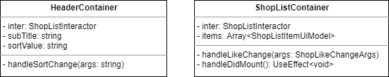
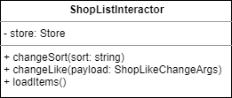
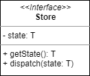
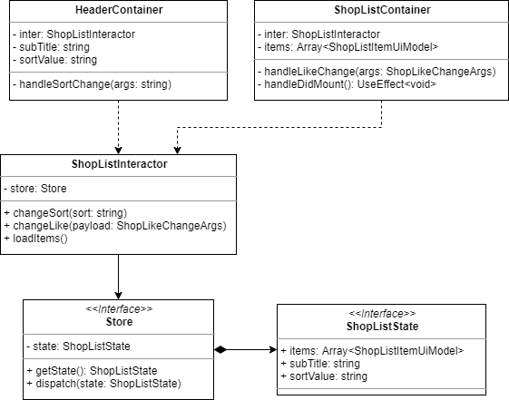

# UI Component Design - 6. 스토어 작성

이전 장에서 언급되었던 인터렉터(Interactor)와 상태(State) 관리기를 함께 작성 해 보겠습니다.

## 진행 순서

1. 액션(Action) 추출
   - 인터렉터에서 쓰일 액션 메서드를 찾습니다.
2. 인터렉터 작성
3. 상태(State) 추출
   - Context 에서 쓰일 State Model 을 위한 필드를 추출하고 모델을 작성 합니다.
4. 스토어 작성
5. 스토어 연관관계 표현
   - 만들어진 컨테이너와 인터렉터, 상태, 스토어를 연관 짓습니다.

## 액션 추출

전에 만들었던 컨테이너들을 다시 여기에 불러 오겠습니다.

이 컨테이너들을 바탕으로 인터렉터가 가져야 할액션(Action) 부터 추출 해 보겠습니다.

HeaderContainer 부터 보면 아래와 같은 액션이 필요함을 알 수 있습니다.

- 정렬 변경 되었을 때 알리기

다음은 ShopListContainer 입니다.

- 좋아요! ..가 변경 됨을 알리기
- items 자료 요청하기

위 두 내용을 붙여서 메서드명으로 바꿔보면 다음과 같습니다.

- changeSort
- changeLike
- loadItems

subTitle 의 날짜 자료는 `loadItems` 를 할 때 서버에서 가져온다 가정하고 별도 불러오는 것을 생략 하겠습니다.

만약 따로 가져온다해도 `loadItems` 에서 Promise.all 이나 rxjs 기준, zip 같은 combination operator 를 이용하여 함께 가져와 처리할 수 있습니다.

## 인터렉터 작성

그럼 추출된 액션을 바탕으로 인터렉터를 다이어그램으로 작성 해 보겠습니다.

위에 언급된 메서드들을 포함시켰으며 추가로 store 도 private 멤버로 추가 하였습니다.

## 스토어 작성

스토어는 Redux 의 Store 가 될 수도 있고 Context 의 Store 가 될 수도 있는데, 여기선 구별 없이 그냥 `Store` 라 명명 하겠습니다.

Store 는 크게 2가지 메서드를 가집니다.

- getState : 모든 상태 값을 가져옵니다.
- dispatch : 상태를 변경합니다.

어떤 형태의 API를 통해 스토어를 구성할지는 설계에선 제외할 것이므로 인터페이스로 선언 하였으며 내부에 상태를 가지도록 하였습니다.

## 상태 작성

스토어가 가져야 할 상태에 대해서 알아보겠습니다.

필요한 상태를 먼저 추출 해야 할텐데,

이건 각 컨테이너에서 받아들이는 private member 를 뽑아내어 쭉~~ 정리하면 됩니다!

어떤게 있었는지 다시 찾아 보려면 귀찮으실테니 아래에 펼쳐 보겠습니다. 🙂

보이시나요?

이 중 Interactor 의 인스턴스인 `inter` 만 제외하고 나머지를 모두 나열 해 보겠습니다.

- subTitle
- sortValue
- items

이들을 모아서 상태 모델을 작성하면 다음과 같습니다.

어떤가요?

참 쉽죠? 🙂

참고로 비동기로 데이터 불러올 때 fallback 상태를 알려주기 위한 `loading` 은 제외 하였습니다.

개인적으로 필요하다면 넣으셔도 됩니다!

## 서로 연관 짓기

만들어진 컨테이너와 인터렉터, 스토어, 그리고 상태까지.

이 4가지를 서로 연관 지어 줄 겁니다.

혹시 어떻게 화살표가 이어질지 상상이 되시나요?

거기에 이미 머릿속에서 어떻게 코드를 짜야하는지 그려진다면 당신은 능력자! 👍

그럼 상상하신 걸 바탕으로 연관 지어 보겠습니다.

그 결과는 아래와 같습니다.

두 컨테이너는 인터렉터를 반드시 필요로하며 이 것은 의존성 관계 입니다.

인터렉터는 스토어가 필요하긴 하나 이론적으론 같은 역할을 하는 다른 스토어를 바라볼 수 있으므로 의존성이 높다 보긴 어렵다 판단하여 일반 화살표로 표현 하였습니다.

상태는 스토어와 생사를 같이 하므로 블랙 다이아를 붙여 주었습니다.

## 정리하며

이렇게 스토어 부분까지 끝이 났습니다.

여기까지 함께 해 오셨다면 아시겠지만

아직 `Server Model` 에 대해서는 한마디도 안하고 있습니다.

왜일까요?

간단합니다.

UI 에서는 서버 모델에 대해서 알지 못하기 때문입니다.

혹은 알아야 된다면 알지 못하게 설계에서 바꿔야 마땅합니다.

이런 서버 모델에 대한 UI 모델로의 변환은 인터렉터에서만 이뤄지도록 FE 아키텍처에서 제한하고 있습니다.

이러한 규칙을 통하여 지금껏 함께 조사하고 만들어 갈 이 많은 UI 컴포넌트들이 영향을 덜 받게 하는 것이죠!

이런 패턴을 두고 `Presentation Model Pattern` 이라 부릅니다.

익히 아시겠지만 그래도 다시 한번 언급 해 봤습니다~

자~ 어떠하신가요?

아직 까진 참 쉽지 않습니까? 🙂

그래서!

이쯤하여 밥 아저씨 소환 들어갑니다!

그럼 다음으로 쓩~!
