# UI Component Design - 7. 모델 연관 짓기

앞서 만들었던 UI 모델들을 기억 하시나요?

다시 되새겨 보자면 아래와 같습니다.

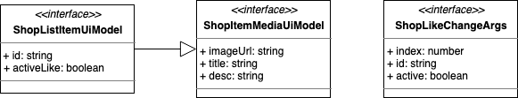

이들을 지금껏 만들었던 다이어그램에 연관 시킬겁니다.

## 모듈화

다이어그램을 그리다 보면 이들을 하나의 그룹으로 묶어야 할 때가 있습니다.

이럴 때 쓰이는 도형을 두고 `모듈 다이어그램 (Module Diagram)` 이라 부르며 기본적인 형태는 다음과 같습니다.

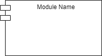

이 다이어그램을 바탕으로 위에 언급된 모델들을 넣어서 모듈화 시키겠습니다.

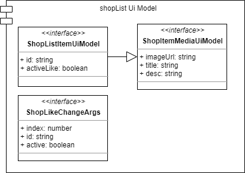

짜잔! 보시다시피 사용 방법은 간단합니다.

그냥 저 모듈 사각형 안에 들어갔음 하는 아이들(?)을 넣어주시면 됩니다!

## 연관 위치 선정

다음은 모델을 직접 연관 시킬 부분을 찾아 보겠습니다.

먼저, 여러분들이 지금껏 만드신 설계도 부터 보여 드리겠습니다.

놀라지 마세요~!

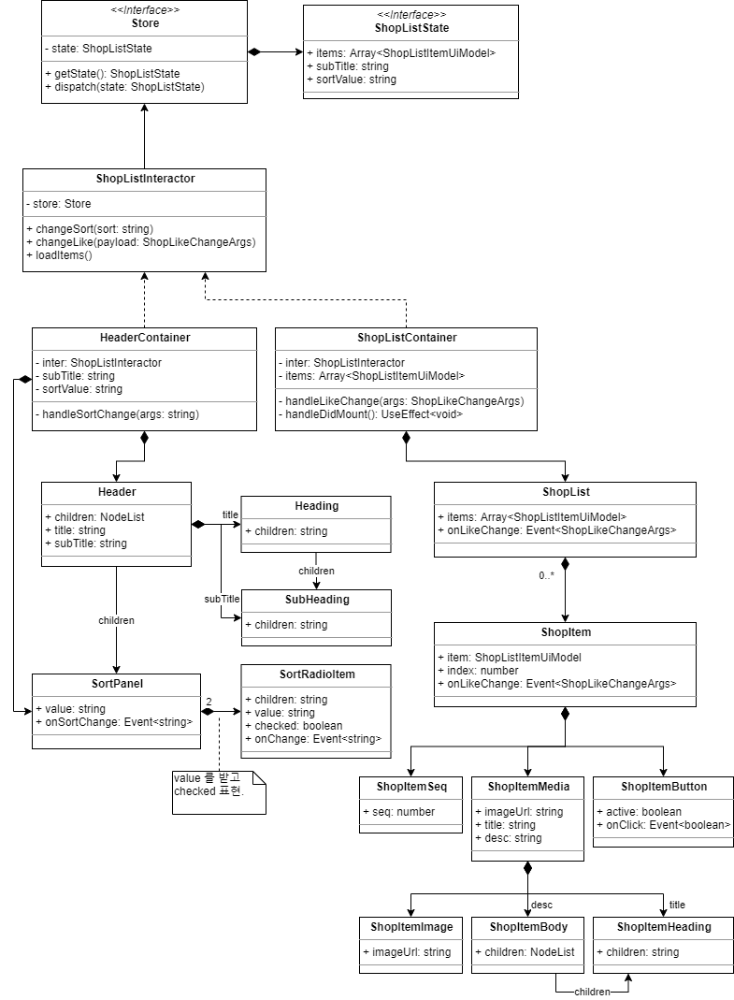

오오..! 😱 이젠 제법 많군요!

그래도 모양새가 제법 갖춰졌으니 나름 뿌듯하시리라 믿습니다! 👍

참고로 컨테이너와 스토어 부분은 방향만 좀 바꿨습니다.

이제 저 설계도에서 아래 UI Model 이 각각 연관될 곳을 찾아 보아야 합니다.

- ShopLisItemUiModel
- ShopItemMediaUiModel
- ShopLikeChangeArgs

그럼 바로 시작 해 보겠습니다.

저 각각의 모델들이 언급된 곳을 모두 찾아봅시다.

저는 여러분들이 보기 쉽도록, 위 3개의 모델을 대상으로 각각 1~3 번까지 `빨강`, `파랑`, `초록` 으로 표시 해 두었습니다.

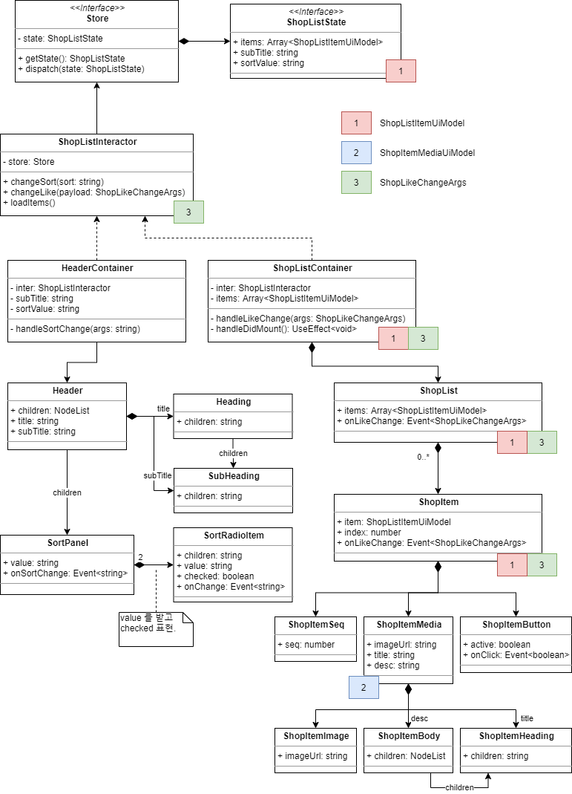

어라~? 모델이 고작 3개인데 이렇게나 참조를 많이 하고 있습니다!

과연 저 모든 곳에 다~~ 연관을 시켜야 할까요?

아니요!

그건 매우 비효율적일 뿐더러 불필요 합니다.

### 자료의 흐름을 따라

우린 `Flux Architecture` 의 단방향 자료 흐름(Unidirectional data flow)을 응용하고 있습니다.

따라서 자료의 흐름을 따라가 보시면 됩니다.

먼저 `ShopLisItemUiModel` 을 살펴 보겠습니다.

모델을 연관 시킬 땐 그 해당 모델이 데이터 흐름에서 가장 처음 언급되는 부분, 즉 `시작점(Start point)을 주목` 하시면 됩니다.

어디서부터 시작하나요?

네! 상태(State) 부터 시작하는군요!

이유는?

지금껏 함께 작성한 UI 컴포넌트는 죄다 `Stateless Component(상태 없는 컴포넌트)` 이기 때문이죠!

혹시 위 설계도를 프린트 하셨다면 연필로 위에서 아래까지 쭈욱 그어보세요!

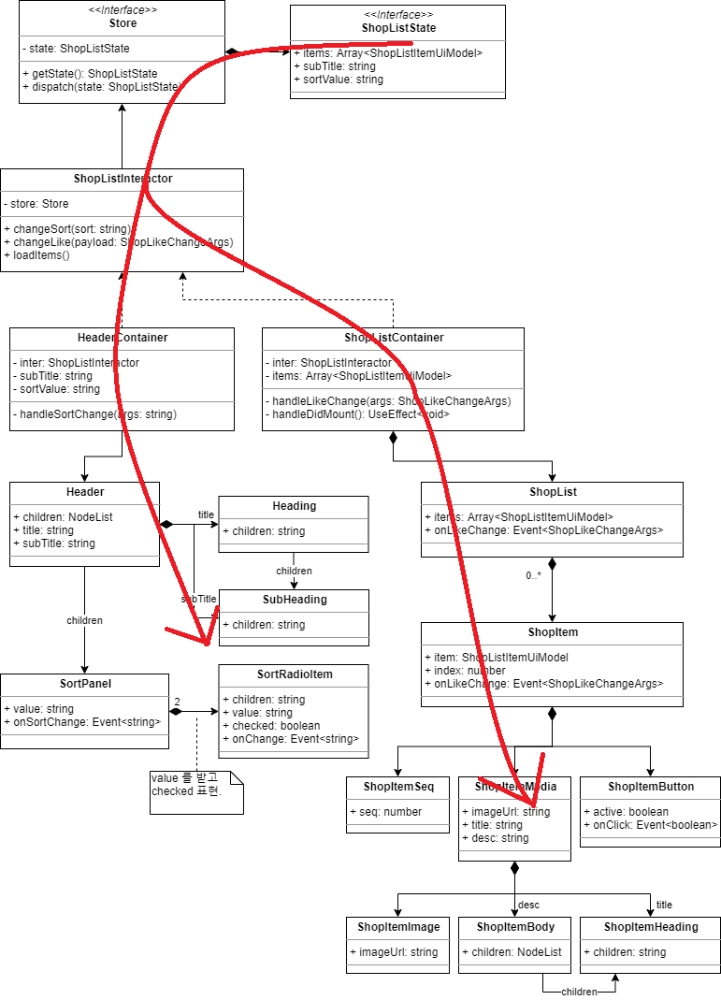

못난 손으로(?) 빨갛게 물들여 보았습니다. 😅

그럼 ShopLisItemUiModel 을 연관 시켜야 할 곳은 어디일까요?

넵! 당연히 `ShopListState` 로군요!

그럼 저 State Model 옆에 연관 시켜 보겠습니다.

모델 패키지 그림이 꽤 크므로 다음과 같이 조그맣게 축소 시켜 묘사 하겠습니다.

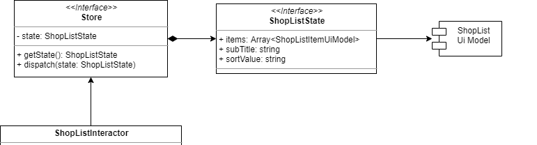

다음 목표는 `ShopItemMediaUiModel` 입니다.

이 모델이 최초 시작되는 위치는...

음...!

`ShopItemMedia` 컴포넌트 군요!

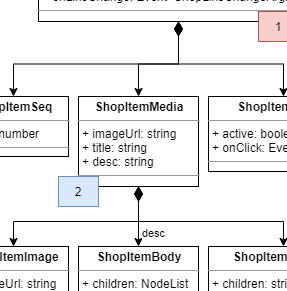

ShopItemMedia 는 ShopItemMediaUiModel 를 필요로 하는 유일한 클래스 입니다.

엇! 근데 ShopItemMediaUiModel 는 `ShopListItemUiModel` 의 부분집합(Subset) 이었습니다.

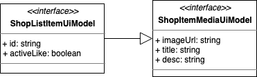

최상단 State 에서 자료가 출발하여 거치고 거쳐서 결국 ShopItemMediaUiModel 은 ShopItemMedia 로 변환(Convert)되어 `ShopItemMedia` 컴포넌트까지 다다를 것입니다.

변환 시점은 언제일까요?

넵! ShopItemMedia 컴포넌트를 사용하는 시점 입니다!

그 때까진 변화가 되어도 의미가 없으며 해도 안되겠죠!

그래서 ShopItemMediaUiModel 은 `ShopItemMedia` 만이 연관 지으면 됩니다!

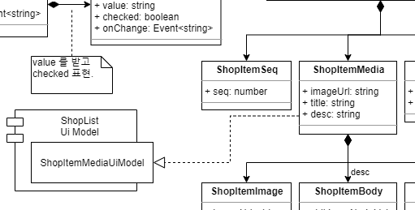

이 때 단순한 직접 연관이 아니라 Realization(실체화)로 표현 해야 합니다.

Realization 이란 인터페이스(interface)를 구현한 것으로써, TypeScript 의 문법으로 비교하자면 `implements` 와 같습니다.

```ts
class ShopItemSeq implements ShopItemMediaUiModel {
  // codes...
}
```

즉 implements 에 대해서는 점선으로 된 속이 빈 화살표로 연관 짓는다 보시면 됩니다.

한편, 좌측 추가된 모듈 다이어그램에 `ShopItemMediaUiModel` 이 툭 튀어나온 형태로 표현되어 있습니다.

어떤게 맞을까요?

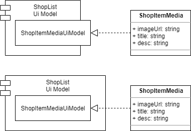

위 그림은 2가지 형태를 모두 제시한 예시 입니다.

윗쪽이 현재 선택한 방식이고, 아래는 관련 모델을 모듈안에 다 집어 넣어진 모습입니다.

결국 답은 `상황에 따라 취향껏 선택`하시면 됩니다.

저는 설계도 내 다이어그램이 점점 많아지고 있어서, 공간을 좀 줄여보려고 전자를 택했습니다.

### 실체화를 쓴 사유


ShopItemMedia 는 ShopItemMediaUiModel 을 직접 연관이 아니라 실체화를 가리키고 있습니다.

이유가 뭘까요?

이유를 나열 해 보자면 다음과 같습니다.

모델명이 길어서 이하 ShopItemMediaUiModel 는 `A` 로, ShopListItemUiModel 은 `B` 라 지칭 하겠습니다.

- A 는 B의 부분 집합(Subset)이다.
- A 는 ShopItemMedia 컴포넌트에 필요한 Props 였다가 모델화 되었다.
- 원래 Props 는 별도 interface Model 로 쓰이고 다이어그램에도 명시하나 편의성을 위해 클래스의 속성으로 모두 옮겼다.
- 그러다 보니 ShopItemMedia 에서 A 의 명칭을 찾을 수 없다.
- ShopItemMedia 과 A 가 연관되어 있음을 표현 해야한다.
- 근데 ShopItemMedia 의 각 속성은 A의 그것과 일치한다.
- 그래서 ShopItemMedia 는 A 인터페이스를 실체화(Realization) 한 것으로 표현 하였다.
- ~~??~~
- ~~Profit !!~~

사유는 이정도 입니다. 🙂

이해가 되셨음 좋겠습니다.

다만, 개인적으로 설계할 때는 처음 처럼, Props 를 따로 모델로 분리하여 연관 시키셔도 무방합니다!

### Event Arguments

마지막으로 `ShopLikeChangeArgs` 를 연관시켜 보겠습니다.

처음에 얘기한대로 `시작점(Start point)` 을 찾아 보세요!

어딘가요?

넵! `ShopItem` 입니다.

그럼 아까처럼 연필로 자료 전달 경로를 쭈욱~ 그어 볼까요?

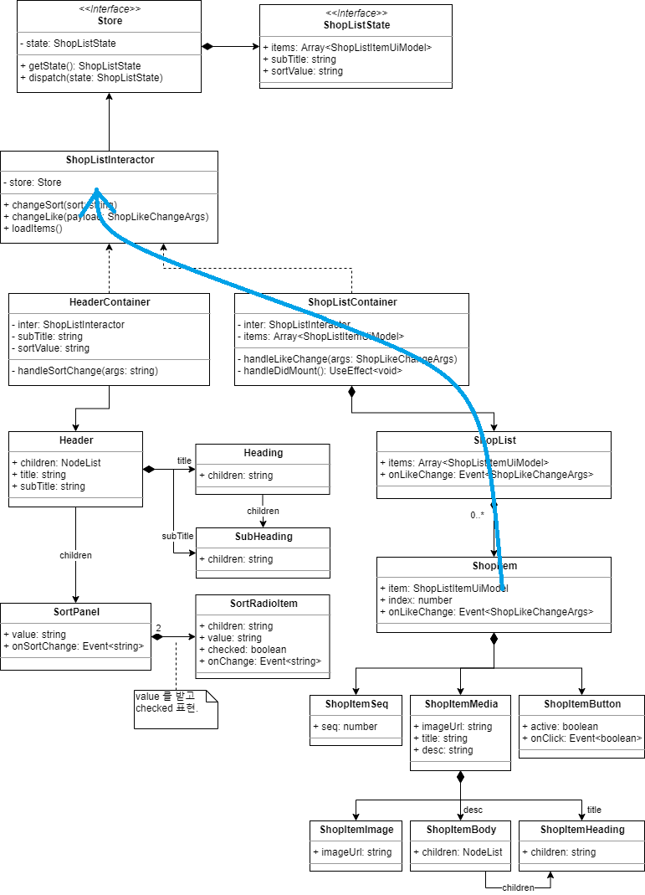

어떤가요?

아까 State 와는 달리 `Event 는 아래에서 위로 가는 느낌`이죠?

이제 확인이 되셨으니 모델을 연관 시켜 보겠습니다!

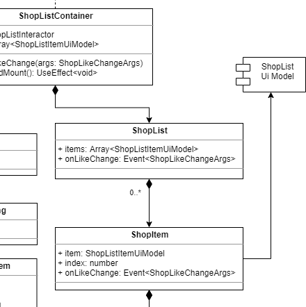

아래는 완성된 전체 설계도 입니다.

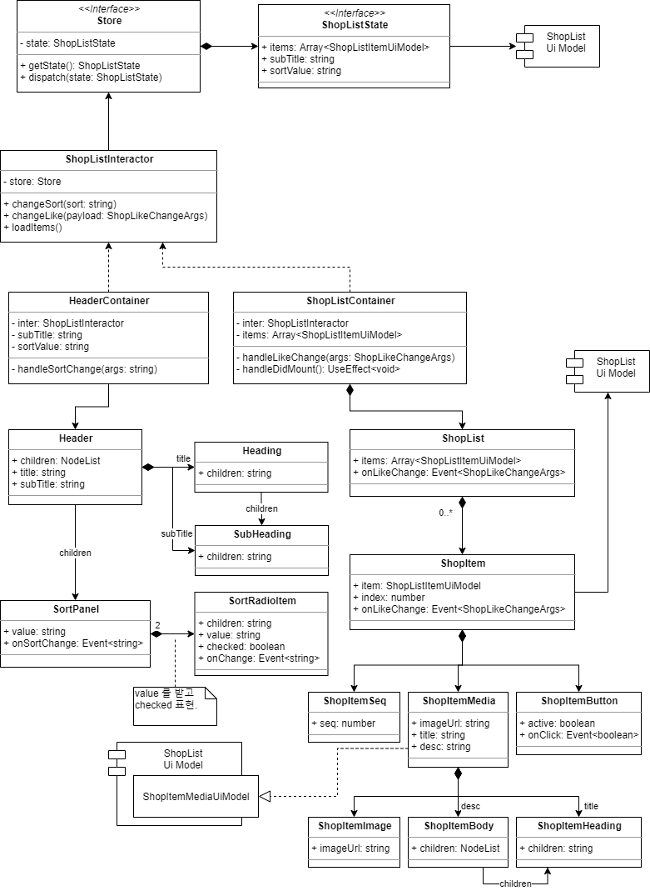

## 정리하며

얼떨결에 모델을 연관 짓다가 플럭스 아키텍처의 자료의 흐름을 체험 하셨네요 😅

분명 여기까지 함께 그리셨고 클린 아키텍처를 알고 계신다면

의존성의 방향이 으웬~~지? 윗쪽으로 향한다는 걸 느끼셨을 것입니다.

여기서 윗쪽은 State 나 Model 쪽인데 이들은 클린 아키텍처의 엔티티(Entity)에 속하는 것들 입니다!

의도 했냐구요?

아닙니다~! ~~(응 맞아여 ㅎㅎ)~~

이렇게 자료 흐름에 따라 설계를 진행하면 자연스레 이러한 구조가 나오게 될 것입니다. 🤣

~~(정말이에여)~~

그럼 다음으로 쓩~~!!
