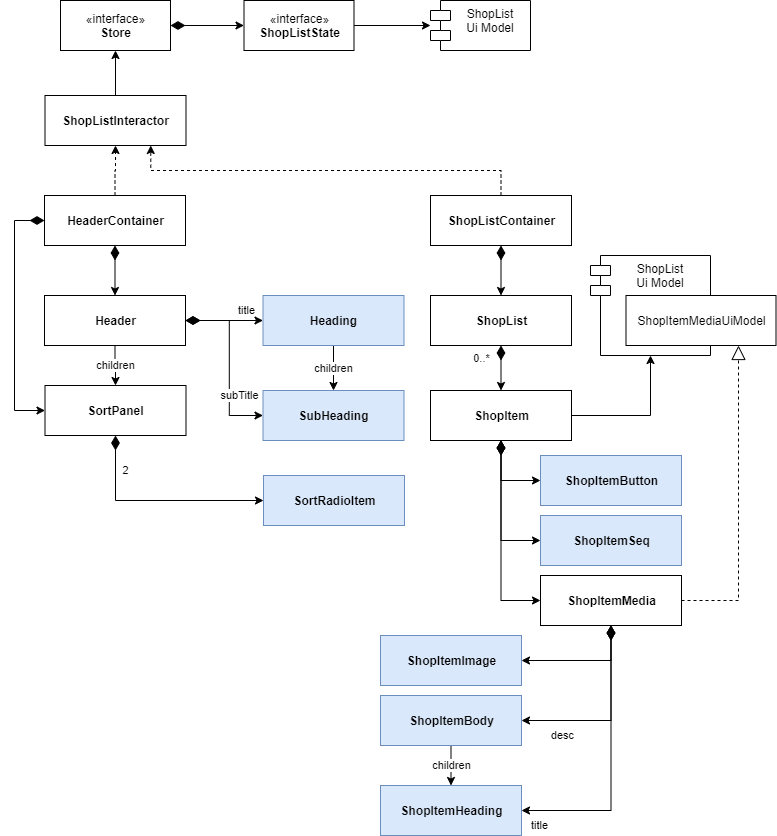
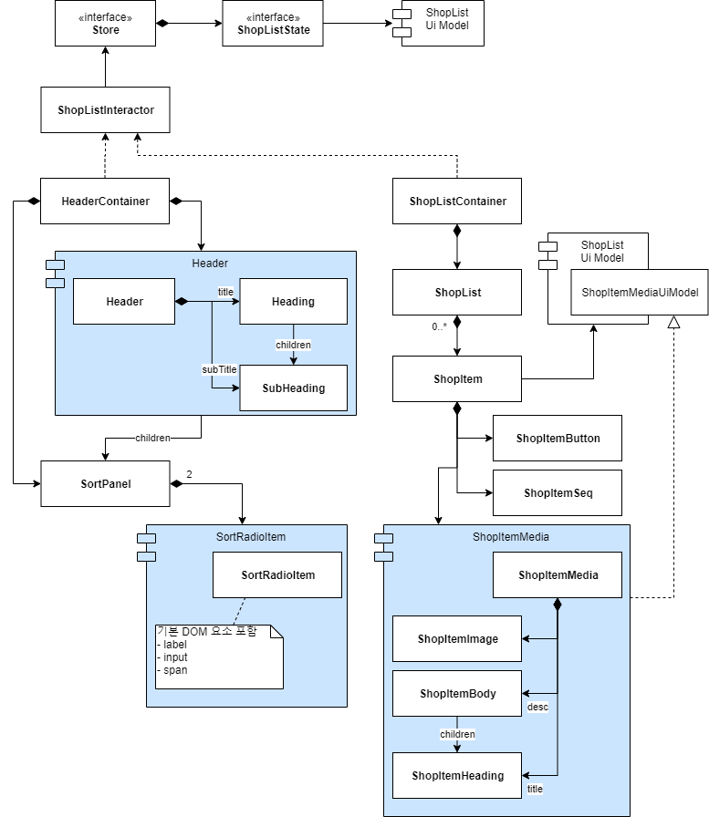
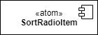
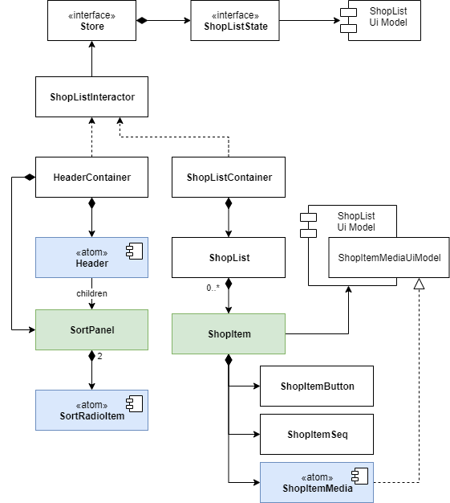
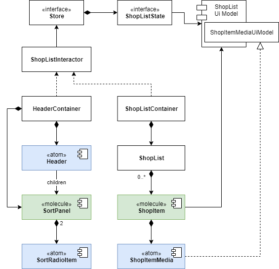
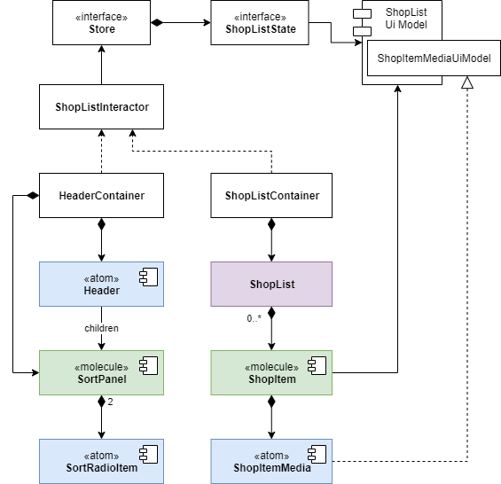
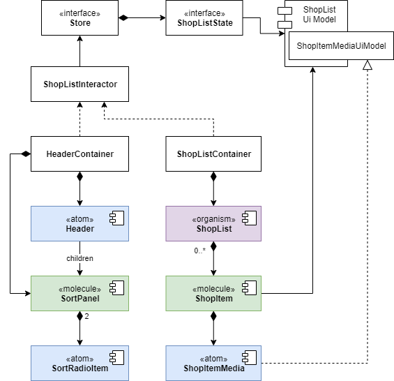

# UI Component Design - 8. 아토믹 디자인

컴포넌트를 작성하다 보면, 이들의 덩치가 커지게고 이러면 각각의 기능이 복잡해지는 경향이 있습니다.

그래서 분리를 하게 되고 `단일 책임 원칙(SRP - Single Responsibility Principle)`을 준수하게 만듭니다.

우린 이에 대한 해결 방안으로 `아토믹 디자인(Atomic Design)`을 채용하고 있습니다.

참고로 이 지면에서는 아토믹 디자인의 정의에 대해서는 언급하지 않으니 이 점 양해 바랍니다. 🙂

## Atoms

우린 UI 컴포넌트를 작성 하였으므로 이것을 아토믹 디자인에 맞추어 모듈 단위로 쪼개어 볼겁니다.

아토믹 디자인에서 가장 작은 소단위는 atom(원자) 입니다.

아래 설계도를 바탕으로 atom에 대응되는 컴포넌트를 찾아보겠습니다.

참고로 지난번 작성 했던 설계도는 속성(attribute)이 너무 많아 보기 불편했으므로 아래와 같이 축약하여 표현 해 보았습니다.



각자가 찾아 보시고 위 내용과 비교 해 보세요.

저는 atom에 대응되는 컴포넌트는 `파랑색`으로 표시 해 두었습니다.

이들의 공통점은 뭘까요?

네! 컴포넌트 중에서도 가장 밑단(Bottom)에 있는 것들 입니다.

클린 아키텍처와 비교하자면?

가장 바깥에 위치하는 것들 입니다!

### 숨겨진 컴포넌트

그러나 이대로 작성한다 생각하면 파일 개수만 해도.. 우와... 😱

그래서 atom 단위로 최대 5개의 컴포넌트를 묶을 것입니다.

묶을 컴포넌트는 위에 언급된 Bottom Component 입니다.

atom 실제 atom 에 쓰일 컴포넌트는 아래와 같이 `빨강`으로 표현 하였습니다.


빨강으로 마킹된 것을 정리 해 보겠습니다.

- Header
- SortRadioItem
- ShopItemMedia

엇! 근데 **SortRadioItem** 이 파란색에서 바뀌었군요!

왜 바뀌었을까요?


이러한 라디오버튼은 생각보다 내부가 복잡합니다.

버튼 하나로 만들 수도 있지만, 웹표준을 생각하자면 그렇게 만들면 안됩니다.

그럼 어떻게 만들어야 할까요?

작성 시 예상되는 HTML 마크업은 다음과 같습니다.

```html
<label>
  <input type="radio" value="goods" />
  <span>상품</span>
</label>
```

보시다시피 최소 3개의 요소가 들어갑니다.

이들을 **styled component**로 스타일을 적용한다 보았을 때, `<label>`, `<input>`, `<span>` 3개가 각각의 별도 컴포넌트가 됩니다.

다만, 이러면 파일 개수가 지나치게 많아지므로 **어느 적정선에서 묶어주고 atom 으로 정의한 것**입니다.

기억하세요!

설계는 어디까지나 각 **컴포넌트의 기능만을 표현 한 것**입니다.

내부의 마크업은 고려하지 않습니다.

그러나 아토믹 디자인을 적용하기 위해 모듈 단위로 묶다보면 반드시 고려해야 합니다.

이유는?

우리 좀 편해지려구요! 😅

이렇게 설계 단계에선 몰랐다가 아토믹으로 묶는 과정에 발견되는 세부적인 컴포넌트를 `숨겨진 컴포넌트(Hidden Component)`라 부릅니다.

나머지 보텀 컴포넌트는 각각 Single DOM 으로 구성되니 바로 묶어버리면 됩니다!

### 컴포넌트 묶기

묶어야 할 대상이 정해졌으니 모듈화를 시켜 보겠습니다.

지난번에 모듈 다이어그램으로 모듈화 하는 방법을 알려 드렸습니다.

여기서도 똑같이 써 볼겁니다.

보셨던 설계도를 기반으로 모듈로 묶어 보겠습니다.



그냥 묶기엔 표시가 잘 안나는 관계로 모듈로 감싸진 컴포넌트는 파란색으로 표시 해 두었습니다.

이제 묶였으니 아래와 같이 간소화 하겠습니다.


간소화 할 때 쓰인 아래와 같은 다이어그램을 두고 `컴포넌트 다이어그램(Component Diagram)`이라 합니다.



원래 클래스 다이어그램내에 함께 포함해서 사용하는 것은 아닙니다만, 여러 소규모 클래스를 묶어 하나의 컴포넌트처럼 사용하는데 있어 적절한 기호로 보여 가져다 썼습니다.

이 역시 제가 편의상 커스텀으로 사용한다 보시면 됩니다.

## Molecules

다음은 분자(molecule) 단위의 컴포넌트를 묶을 겁니다.

분자가 될 수 있는 컴포넌트를 다시 찾아 보겠습니다.



이번엔 `녹색`으로 표시 하였습니다.

여기서 퀴즈!

분자 컴포넌트의 조건을 기억하시나요?

네! `atom 단위의 컴포넌트를 최소 1개 이상` 가지는 컴포넌트 입니다!

이것도 모듈 다이어그램으로 먼저 묶어 보겠습니다.


묶을 때 기준은 보텀 컴포넌트 까지만 포함 시키는 것입니다.

가령 `ShopItem` 같은 경우, ShopitemButton 과 ShopItemSeq 는 실제 소스코드 까지 포함 시키겠지만, ShopItemMedia 는 그냥 가져다 쓰게 될겁니다.

이렇게 외부에서 가져다 쓰게 될 경우엔 Composition 관계로 두면 됩니다.

아래는 위 내용을 간소화 시킨 것입니다.



추가로, 연관된 모델도 하나를 바라보도록 통일 했습니다.

## Organisms

다음은 유기체(Organisms) 입니다.

유기체의 최소 조건은?

네! `최소 1개 이상의 분자 컴포넌트를 가지는 컴포넌트` 입니다.

그럼 조건의 컴포넌트가 있는지 어디 볼까요?



딱 1개 있습니다. 바로 `ShopList` 입니다.

이 컴포넌트는 내부에 `ShopItem`을 여러개 가지고 있습니다.

ShopItem 은 `분자 컴포넌트` 이니까 결과적으로 ShopList 는 **유기체 컴포넌트** 가 되겠습니다.

모듈 다이어그램으로 범위 지정 할 필요도 없으니 바로 컴포넌트 다이어그램으로 바꿔 보겠습니다.



완성입니다! 👍

## 정리하며

처음 프론트엔드 업무에 아토믹 디자인을 접목시키는 것이 까다롭게 느낀적이 있으실 겁니다.

이번을 통하여 쪼개고 그룹짓는 방법에 대해 익숙해지셨음 하는 바람 입니다.

그럼 다음으로 쓩~~!

## QnA

Q1. 컴포넌트 묶을 때 꼭 **컴포넌트 다이어그램**을 써야 할까요?

아닙니다! 이건 어디까지나 여러분에게 아토믹으로 묶어가는 과정을 간략히 보여드리기 위한 방법으로 선택한 것입니다. 실제 설계가 자신의 개인 업무용으로만 쓰인다면 연습장에 후갈겨(?) 쓰게 되실겁니다. 이 때는 그냥 **동그라미**나 **사각형**등으로 자유롭게 그룹화 시키시면 됩니다! 아토믹으로 그룹화 할 때 숨겨진 컴포넌트에 유의하시고, 코드로 옮길 때 해당 설계 내용이 눈에 띄게만 그려진다면 아무 상관 없습니다. 언제나 중요한건 여러분들의 업무 효율입니다! 🙂 `요약: 여러분의 자유 입니다!`

Q2. 컴포넌트를 아토믹으로 묶을 때 색깔을 꼭 써야 하나요?

역시 아닙니다! 이건 여러분들 보기 편하시라고 임의로 넣은겁니다. 그러니 하지 않으셔도 됩니다.

Q3. 이 단계까지 설계 했는데 뒤늦게 숨겨진 컴포넌트가 발견되어 하위 컴포넌트를 추가 했습니다. 그게 하필 atom 단계라서.. 이걸 molecule 로 올려야 하나요?

네! 다소 번거롭지만 그게 규칙이니 올려 주셔야 합니다. 만약 숨겨진 컴포넌트가 Single DOM 요소라면 기존 atom 컴포넌트내에 포함 시키면 molecule 로 올리지 않아도 됩니다! 하지만 생각보다 덩치가 크고 별도 컴포넌트로 따로 떼어야 한다면 레벨을 올리더라도 분리 시키는게 맞습니다.
