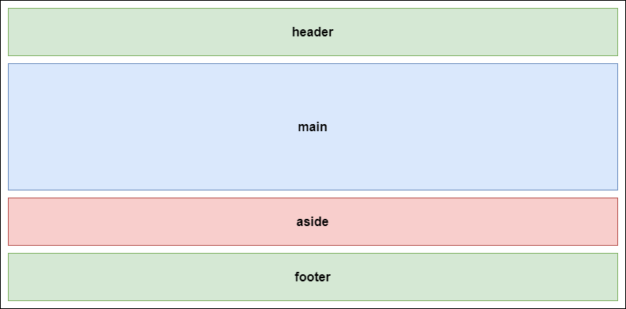
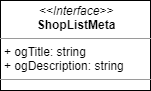
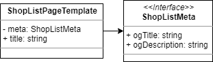
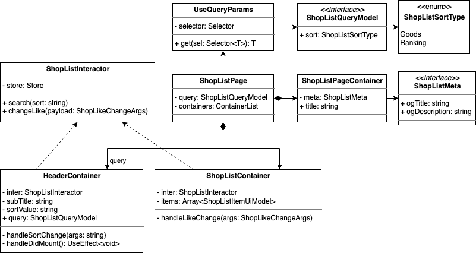

# UI Component Design - 10. 페이지 템플릿 작성

## 페이지 템플릿

페이지 템플릿(Page Template)은 다음과 같은 역할을 맡습니다.

- 페이지의 전체 레이아웃 잡아주기
  - 전체 영역을 가운데로 몰아주거나 상하좌우 동일 여백을 넣어주는 등의 조치
- 헤더, 푸터 같은 상/하단의 공통 영역 제공
- title, open-graph 같은 meta data 제공

이 중 레이아웃과 헤더/푸터 역할을 위한 표현 컴포넌트(Presentational Component)를 포함할 수 있습니다.

페이지 템플릿은 페이지 컴포넌트와 컨테이너들 처럼 CSS 같은 스타일링이 코드에 포함되는 걸 권장하지 않습니다.

또 한 Context 같은 상태 관리기를 사용할 수 있으나 어디까지나 meta data 용도로만 쓰여야 합니다.

만약 헤더, 푸터들이 Context 가 필요하다면, 이들을 별도 컨테이너로 만들어서 가져와 쓰는 형식으로 바꿔야 합니다.

이상이 의도된 규정 입니다. 😉

### 양해 바랍니다

진행하기 앞서 하나 알려 드리자면,

초기 분석 과정에서 페이지 템플릿이 전혀 고려 되지 않았습니다.

이유는 현재 제공된 시안 만으로는 헤더/푸터의 중복 여부를 알 길이 없었으며 거의 앱전용 화면이라 네비게이션도 존재하지 않았기 때문입니다.

또 다른 이유는 처음부터 많은걸 고려하고 가기엔 복잡 했다는 이유도 있겠습니다.

그래서 부득이하게 설계 막바지임에도 불구하고 다른 요소를 추가로 분석하게 되었습니다.

이 점 양해 바랍니다. 🙏

### 분석하기

먼저 시안을 다시 살펴 보겠습니다.


어떤가요?

위에 정의된대로 페이지 템플릿에 들어갈 만한 요소가 보이시나요?

음.. 🤔

일단 메타 데이터 부터 뽑아 보겠습니다.

`제목`이 있을거 같은데, 다른 메타 데이터는 요구 사항에 명시되어 있지 아니하므로 open-graph 내용 중 title 과 description 만 추가 해 놓겠습니다.

아래는 메타데이터 정리 내용입니다.

- title
- og:title
- og:description

다음은 레이아웃 부분인데, 대체로 웹페이지를 HTML5 기준으로 작성할 때 문서 구조가 다음과 같은 형태로 나타납니다.

```xml
<body>
  <header />
  <main />
  <aside />
  <footer />
</body>
```

`<header>`와 `<footer>` 영역에 대한 설명은 생략 하겠습니다. ~~(다들 잘 아시니까)~~

이 중 `<main>` 요소는 사용자가 관심있어 할 만한 주요 컨텐츠가 위치하는 장소 입니다.

참고로 `<aside>` 요소는 광고나 배너 등 현재 페이지와는 전혀 상관 없는 이벤트성 영역 입니다.



위 시안을 봤을 때 사이트 제목이나 로고, 네비게이션등이 포함된 헤더 영역은 없는 것으로 보이구요

푸터 영역도 따로 존재지 않으므로 생략 하겠습니다.

그럼 남은건?

네! 메인(main) 영역 입니다.

헌데 딱히 레이아웃을 잡아주고 할 건 없어 보입니다.

그래서 단순히 `<main>` 요소로 감싸만 주도록 하겠습니다!

끝인가요?

끝이네요! 🤣

### 중요한 것은 데이터

이제 페이지 템플릿을 다이어그램으로 그려 볼겁니다.

앞서 말씀드렸듯이 클래스 다이어그램엔 디자인과 스타일링에 대한 내용은 존재하지 않습니다.

그럼 중요한건 뭘까요?

네! 데이터 입니다.

페이지 템플릿이 가진 데이터는?

바로 메타 데이터 입니다.

그래서 메타 데이터만 따로 모델링 하고 이걸 연관 시키겠습니다.



언급된 open-graph 필드 2개를 나타내었습니다.

아래는 페이지 템플릿에 대한 다이어그램을 함께 표현 한 것입니다.



간단하죠? 🙂

제목(title)을 **ShopListMeta**에 함께 두지 않은 이유는, 페이지 컴포넌트에서 템플릿 이용 시 필요에 따라 제목을 임의로 넣어 주는게 확장성을 보아 용이하기 때문입니다.

만약 제목이 메타 데이터와 맥락을 함께하며 외부를 통한 변경 요인이 전혀 없다면 메타 모델(Meta Model)에 포함시켜 표현해도 전혀 문제 없습니다.

참고로 만약 헤더/푸터가 포함된 페이지 템플릿이면 아래와 같이 나타낼 수 있습니다.


다이어그램에선 별도 모델을 분리하여 나타내었지만, 실제 코딩은 React SPA 기준, 아래와 같이 `<Helmet>` 컴포넌트를 쓰게 될 것입니다.

```tsx
const PageContainer: FC<Props> = ({ title, children }) => {
  return (
    <>
      <Helmet>
        <meta property="og:title" content={title} />
        <meta property="og:description" content="블라블라 즐거운 코딩 ^^" />
        <title>{title}</title>
      </Helmet>
      <StyledMain>{children}</StyledMain>
    </>
  );
};
```

이 때 `<meta>` 요소를 저 헬멧 선언과 동시에 사용해야 하기 때문에 실제론 모델로 따로 추출 해 놓는 것이 의미가 없을 수 있습니다.

다만, 설계도를 보고 `아~ 템플릿에 필요한 메타 데이터가 이런게 있구나` ..라는 것을 기록해 놓는 것에 의의를 가지면 되겠습니다.

한편 메타 데이터 모델이 Context 나 Store 출신이고 거기에 선택자(Selector)를 붙인다면 반대로 굉장히 큰 의미가 있게 됩니다!

자~ 그럼 마무리로 지난번 작성한 페이지 컴포넌트와 연관 시켜 보겠습니다!



## 정리하며

사실 본 내용은 페이지 컴포넌트 작성 때 포함하려 했으나

그게 내용이 너무 길어져서 페이지 템플릿 부분을 부득이하게 따로 분리 하였습니다.

이제 끝이 얼마 안남은거 같네요~

그럼 다음으로 쓩~~!
