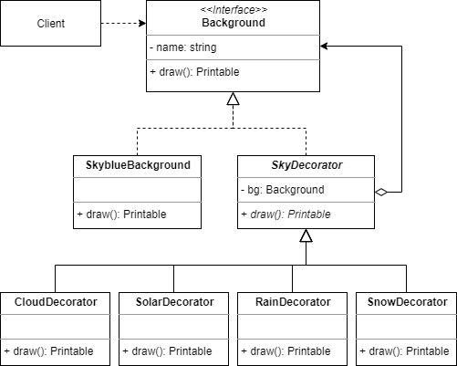
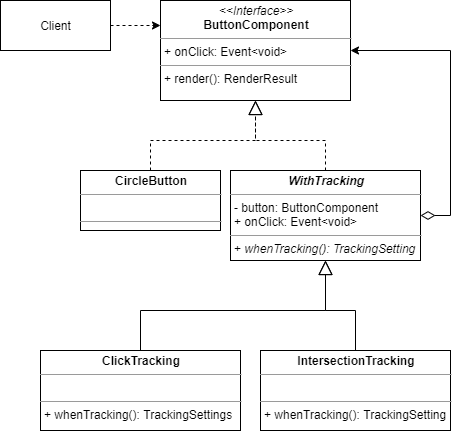
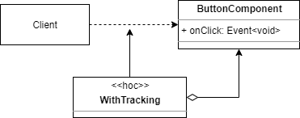
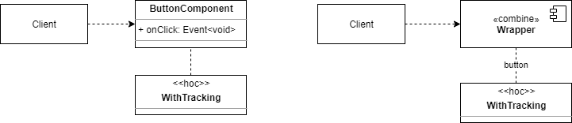
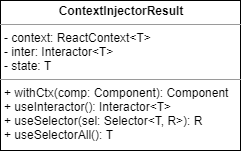
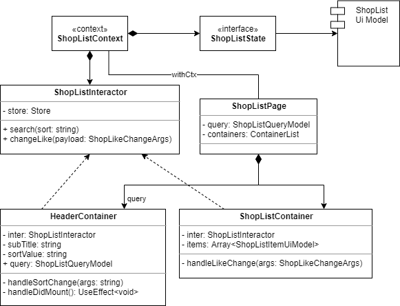
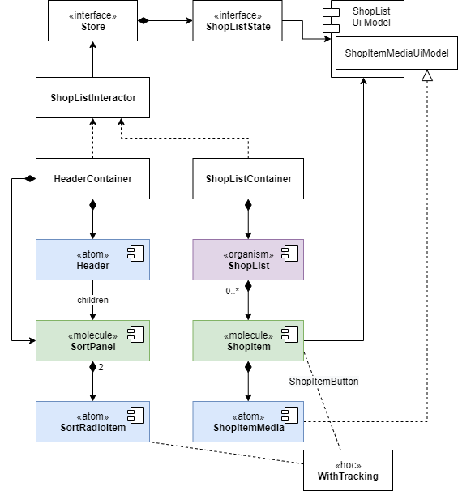

# UI Component Design - 11. HOC 추가

High-Order Component, 줄여서 HOC라 불리는 기능을 컴포넌트에 덧붙여 볼 차례 입니다.

HOC 는 기본적으로 특성이 `Decorator Pattern`과 닮아 있습니다.

## 디코레이터

디코레이터란 **장식**이란 의미로써 패션과 연관된 것으론 대표적으로 반지, 목걸이 같은 악세서리가 있겠습니다.

이런 악세서리 처럼 `기존 기능에 추가적인 행위나 기능을 덧붙이는 것`을 말합니다.

위 다이어그램은 하늘을 그리는 Background 에 구름, 태양, 비, 눈을 덧그리는 디코레이터를 클래스 다이어그램으로 그린 것입니다.

이걸 자주쓰는 HOC 중 하나인 **withTracking** 으로 대상을 바꿔보겠습니다.

버튼 컴포넌트의 onClick 이벤트에 대하여 트래킹 기능을 붙이면 결과적으로 어떤 클래스를 사용하게 될까요?

네! 젤 아래에 있는 `ClickTracking` 을 쓰게 될겁니다!

하지만 사용처에서는 이게 ClickTracking 인지 여부를 모릅니다.

그저 버튼 컴포넌트일줄만 알고 있고, 트래킹 기능이 적용된 줄 모릅니다.

그렇게 자동으로 트래킹 기능이 **쓱~~** 하고 들어가게 됩니다.

이렇게 HOC는 디코레이터 처럼 **해당 컴포넌트에 추가 기능과 책임을 덧붙일 때** 쓰입니다.

엇, 그런데.. 다이어그램으로 그리려니 좀 복잡하군요.. 😱

그래서 이후 hoc 는 다음과 같이 표현 하겠습니다.

제법 간단해졌습니다!

이것도 복잡하시다구요? 😱

그럼 아래와 같은 표현도 HOC 적용으로 간주 합니다!

좌측은 컴포넌트에 HOC가 쓱~~ 하고 붙었다는 의미이며,

우측은 아토믹 디자인의 조합형(combine = molecule) 컴포넌트 내부에 `button` 이라 명시된 보텀 컴포넌트(Bottom Component)가 존재하고 여기에 HOC가 쓱~~ 하고 붙었다는 의미 입니다.

이젠 부담 없이 마구 장식(Decoration) 해 보아요!

## 컨텍스트 적용

`FE 아키텍처` 기준, 인터렉터는 컨텍스트(Context)가 필요합니다.

컨텍스트 적용은 hoc 로 적용하기로 규정되어 있으며 이 기능을 제공하는건 아래와 같은 `ContextInjectorResult` 객체 입니다.

이는 실제론 컨텍스트를 쓰기 쉽게 만든 Wrapper Object 이며 hoc 로 사용하기 위한 것은 위 다이어그램에서 언급된 `withCtx` 입니다.

이런식으로 만들어진 객체를 아래와 같이 스테레오 타입으로 `context` 라 언급 하겠습니다.

이 것은 `ContextInjectorResult` 클래스에 대한 인스턴스이며 명칭은 **ShopListContext** 라는 의미 입니다.

이 것을 이용하여 다이어그램으로 표현하면 다음과 같습니다.

기존 **Store**라 표현되어 있던 것을 **ShopListContext**로 대체 하고 관련 State 를 대신 연결 하였습니다.

ShopListPage 는 ShopListContext 의 withCtx 를 이용하므로 단순 직선으로 연관(Association) 시켰습니다.

이러한 관계들은 순수 UML 로 표현하면 다소 복잡해지므로 어느정도 커스터마이징 한 부분임을 참고 바랍니다. 🙂

이렇게 작성하면, 실제 컨텍스트가 적용되는 곳은 페이지 컴포넌트가 된다 판단하면 되겠습니다.

페이지에 적용한 이유는, 두 컨테이너(HeaderContainer, ShopListContainer)가 하나의 State 와 Interactor 를 공유해서 쓰고 있기 때문입니다.

## 트래킹 적용

이 역시 별도 요청사항엔 없으나 추가 요청이 있어 별도로 붙인다 가정 하겠습니다.

이 중 트래킹 대상은 다음과 같습니다.

- 정렬 변경
- 좋아요 변경

바로 관련 컴포넌트에 적용 시켜 보겠습니다.

그냥 점선으로 연관 시키면 끝입니다!

## 정리하며

뭔가 처음엔 굉장히 복잡해 보였는데, 정작 적용하니 간단해 보이지 않았는지요. 🙂

이는 데코레이터 자체가 데이터 흐름에 영향을 미치지 않도록 설계 했기 때문입니다.

HOC 는 어디까지나 표현 컴포넌트의 기능을 보조 하는 역할이어야 합니다.

이렇게 설계하여 얻을 수 있는 이득은 컴포넌트의 관심사 분리(Separation of Concerns)와 더불어 재사용성(Reusability) 증대를 꼽을 수 있습니다.

이 후 컴포넌트에 부가적인 기능이 덧붙여져야 한다면 HOC를 붙여 주세요!

단, Wrapper hell 이 되지 않도록 주의만 해주시길 부탁드립니다.

## Thanks~

지금까지 잘 따라와 주셔서 정말 감사합니다!

본 가이드가 여러분의 개발 시 발생되는 시행착오를 줄여주는 계기가 되었음 하여 작성한 게 벌써 11장 까지 만들었군요!

우와! 😱

아무쪼록 즐거운 프로그램 개발이 되시길 바랍니다~

수고하셨습니다! 👍

-- fin
